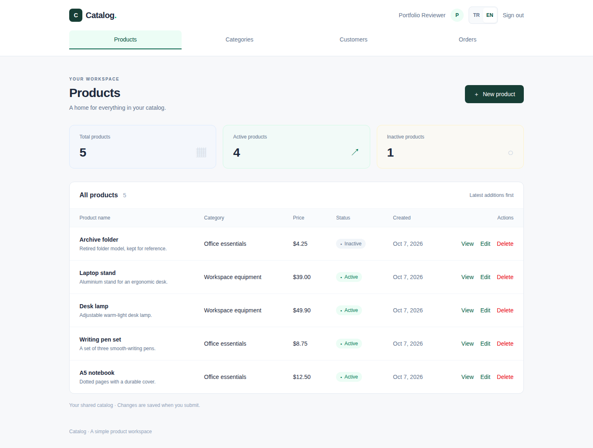
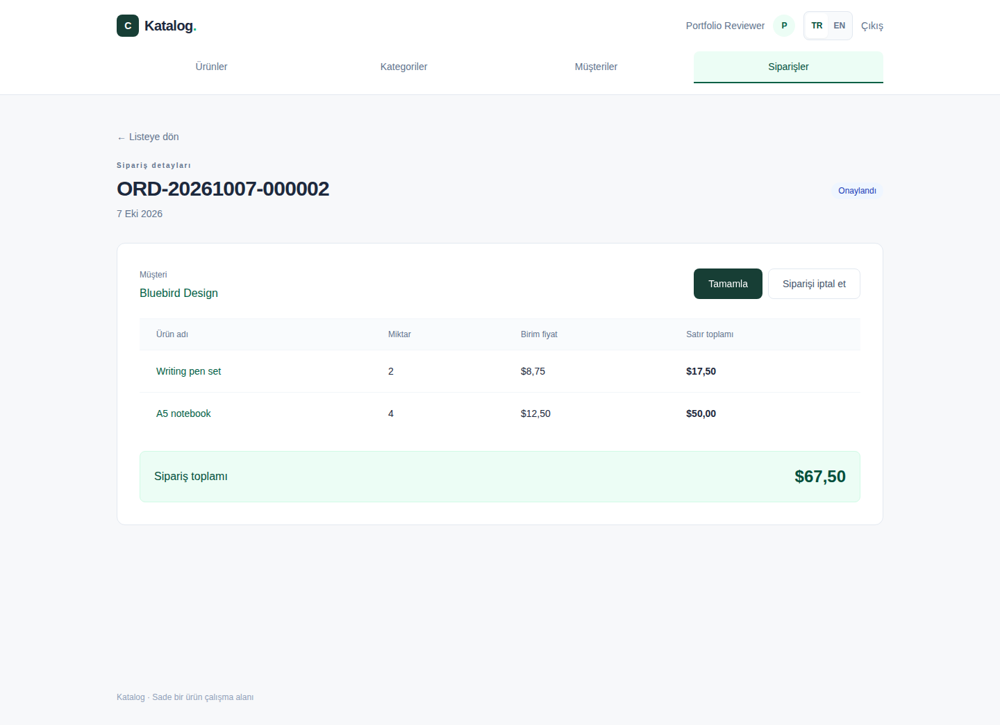
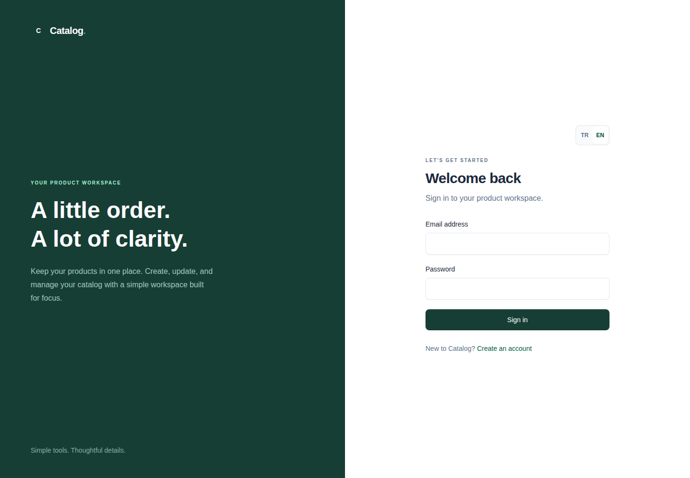
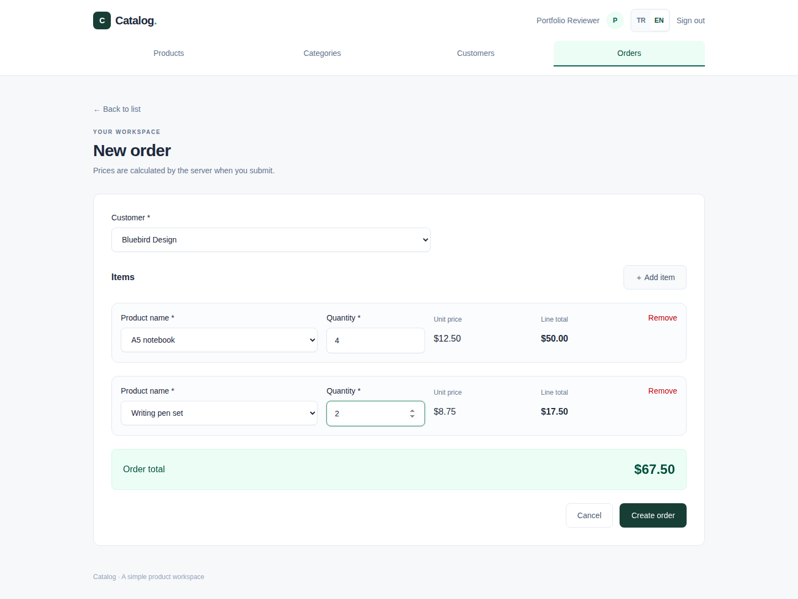
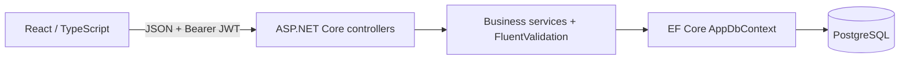
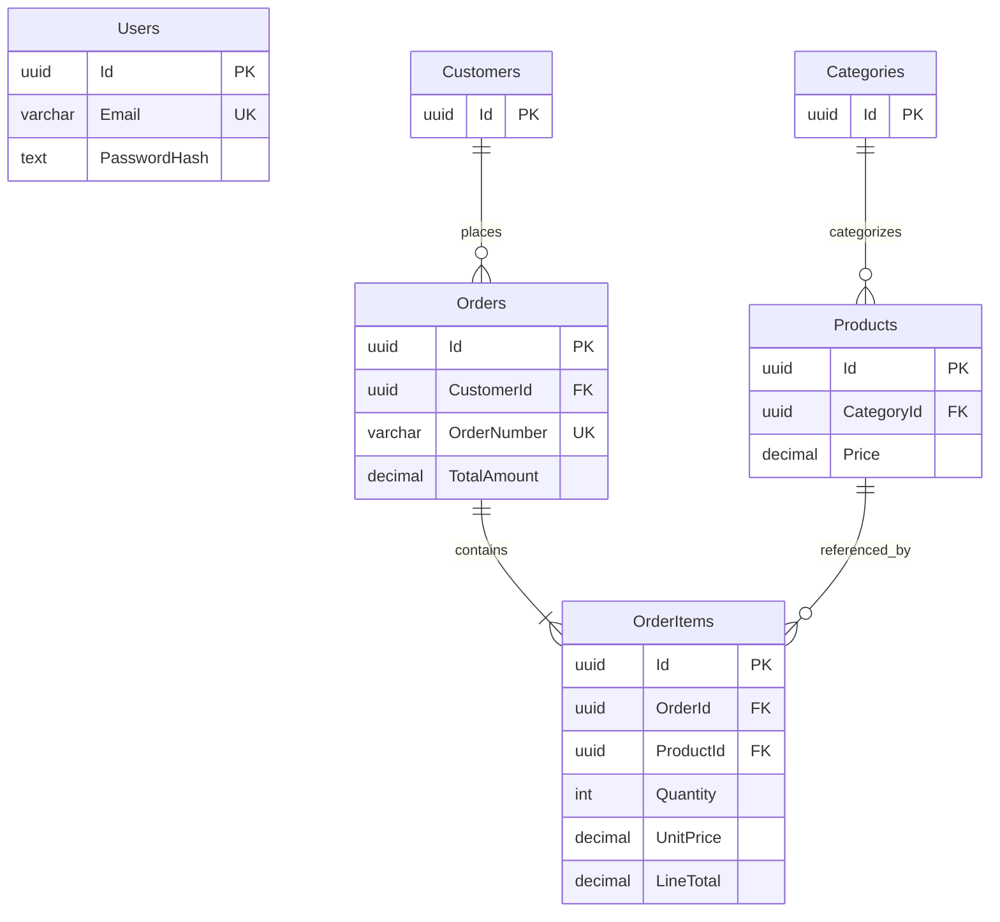
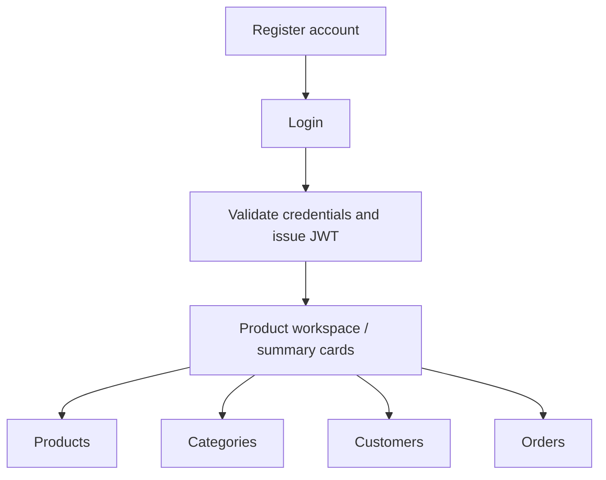

# DemoErp — Catalog business demo

A runnable full-stack engineering portfolio: register/sign in, manage products,
categories and customers, and create orders with prices calculated by the server.
The web interface switches immediately between English and Turkish.

[Türkçe](README.tr.md) · [Architecture](docs/ARCHITECTURE.md) · [Database](docs/DATABASE.md) · [API](docs/API.md) · [Development](docs/DEVELOPMENT.md) · [Verification](VERIFICATION.md)

This source tree contains the complete standalone demo. Earlier commits describe a
different, private manufacturing ERP; its samples and visuals are superseded here.
The current application does not include manufacturing, barcode or desktop modules.
Verification includes builds, PostgreSQL integration tests and browser acceptance tests.

## Features

- Registration, password hashing, JWT login and protected API/UI routes.
- Product, category and customer list/detail/create/edit/delete screens; active flags
  and reference protection for deletion. Every product belongs to a category.
- Orders with multiple distinct products, quantity validation, database price
  snapshots, transaction rollback and unique sequence-backed order numbers.
- Pending → Confirmed → Completed status flow, with cancellation before completion.
- TR/EN navigation, forms, validation, dialogs, dates and number formatting; responsive
  mobile cards and accessible native confirmation dialogs.
- Persistent PostgreSQL data, committed migrations, one-command Docker startup and
  Development Swagger/OpenAPI.

## Screenshots

Real Chromium captures from the running application, using synthetic demo records
in a disposable PostgreSQL database. No production data is shown.

| English product workspace | Turkish order detail |
| --- | --- |
|  |  |

| Login | Order creation |
| --- | --- |
|  |  |

Additional captures: [categories](docs/screenshots/categories-en.png),
[customers](docs/screenshots/customers-en.png), [orders](docs/screenshots/orders-en.png),
[Turkish products](docs/screenshots/products-tr.png). [Capture procedure](docs/DEVELOPMENT.md#screenshots).

## Tech stack

Frontend versions below are resolved from the committed npm lockfile; .NET packages
are explicit project references. Container tags are configured versions, not immutable
image digests.

| Area | Technology / version |
| --- | --- |
| Frontend | React 19.3.0, TypeScript 5.9.3, Vite 6.4.4, Tailwind CSS 4.3.3 |
| Routing / server state | React Router 7.18.4, TanStack Query 5.104.1 |
| Forms / validation | React Hook Form 7.89.0, Zod 4.1.11; FluentValidation 12.1.1 |
| Backend | ASP.NET Core / .NET 10; verified SDK 10.0.401 |
| ORM / database | EF Core 10.0.12, Npgsql EF provider 10.0.3, PostgreSQL 17 |
| Authentication | JWT Bearer 10.0.12, HS256; Identity PBKDF2 password hasher |
| API documentation | Swashbuckle 10.3.0 |
| Backend tests | xUnit v3 package 4.0.1, ASP.NET testing 10.0.12, Testcontainers 4.15.0 |
| Browser tests | Playwright 1.63.0, Chromium |
| Containers | Docker Compose v2; SDK/ASP.NET 10, Node 22 Alpine, PostgreSQL 17 Alpine, unprivileged Nginx |
| CI | GitHub Actions: backend build/tests and frontend build; no deployment workflow |

## System architecture

One API project separates concerns through directories and scoped services; it does
not claim separate Application/Infrastructure projects.



See [architecture decisions](docs/ARCHITECTURE.md) and the source in
[controllers](backend/Demo.Api/Controllers), [services](backend/Demo.Api/Services),
[contracts](backend/Demo.Api/Contracts) and [data](backend/Demo.Api/Data).

## Database architecture



Users have no business-record ownership relationships. API-created orders require
at least one line; this minimum is enforced by validation. Foreign keys protect
referenced category/customer/product records; order-item deletion cascades only
when an order is administratively deleted. [Full schema and migrations](docs/DATABASE.md).

## Application workflow

The authenticated landing page is the product workspace with summary cards; there
is no separate dashboard route.

```mermaid
flowchart LR
  Customer[Select active customer] --> Product[Select active products]
  Product --> Quantity[Enter quantities]
  Quantity --> Validation[Server-side validation]
  Validation --> Price[Read database prices and calculate totals]
  Price --> Persist[Persist order and lines in one transaction]
  Persist --> Pending[Order created: Pending]
  Pending --> Confirm[User confirms order]
  Confirm --> Confirmed[Status: Confirmed]
```





Browser totals are previews. Order creation accepts only customer/product IDs and
quantities; the API calculates prices/totals. Stored unit prices do not change when
product prices change. Product/customer names remain live references.

## API

Default base URL: http://localhost:5080/api. Business endpoints require Bearer JWT.

| Module | Endpoints | Authentication |
| --- | --- | --- |
| Auth | POST /auth/register, POST /auth/login | Public; rate limited |
| Products | GET/POST /products; GET/PUT/DELETE /products/{id} | Bearer |
| Categories | GET/POST /categories; GET/PUT/DELETE /categories/{id} | Bearer |
| Customers | GET/POST /customers; GET/PUT/DELETE /customers/{id} | Bearer |
| Orders | GET/POST /orders; GET /orders/{id}; PUT /orders/{id}/status | Bearer |
| Health | GET /health (outside /api) | Public |

[Detailed endpoint contracts](docs/API.md) · [Local Swagger](http://localhost:5080/swagger).
There is no order-delete, refresh-token or server logout endpoint.

## Getting started

Requires Docker Desktop with Linux containers, or Docker Engine with Compose v2.

```sh
git clone https://github.com/SCanerG/DemoErp.git
cd DemoErp
# Optional: copy .env.example to .env and customize development settings.
docker compose up --build
```

Development defaults work without a .env file or host SDK. The example contains
clearly marked local placeholders; never use these as production credentials.
Register your own account; fresh databases have no seeded login or business data.

| Service | URL |
| --- | --- |
| Frontend | http://localhost:3000 |
| Swagger / OpenAPI | http://localhost:5080/swagger / http://localhost:5080/swagger/v1/swagger.json |
| Health | http://localhost:5080/health |

PostgreSQL is internal to Compose. Health checks order startup and the API applies
migrations automatically. `docker compose down` retains the database volume;
`docker compose down -v` deletes it. [Environment variables and local development](docs/DEVELOPMENT.md).

## Engineering decisions

- Scoped services/DbContext keep HTTP handling, business rules and persistence clear
  within one API project. Explicit DTOs omit hashes and persistence internals.
- FluentValidation is authoritative; Zod gives browser feedback. Database constraints
  enforce uniqueness, foreign keys and numeric invariants under concurrency.
- EF read projections and AsNoTracking avoid tracking overhead and per-item queries.
- Repeatable-read order transactions prevent partial writes; PostgreSQL sequence
  allocation and a unique index provide concurrent order-number safety.
- JWT validates issuer, audience, signature and expiry. Passwords are salted PBKDF2
  hashes. Session expiry/401 clears browser state; logout does not revoke JWTs.
- Localization uses one dictionary and a React subscription, with storage fallback.
- Errors return safe ProblemDetails and trace IDs; structured logs avoid sensitive
  request/SQL values. [Details and tradeoffs](docs/ARCHITECTURE.md).

## Testing

.NET 10 SDK and running Docker are required for PostgreSQL integration tests:

```sh
dotnet build Catalog.slnx
dotnet test
cd frontend
npm ci
npm run build
npx playwright install chromium
npm run test:e2e
```

Browser tests require the running Compose stack. Docker Chromium is also supported;
see [development commands](docs/DEVELOPMENT.md). The backend suite covers auth,
CRUD, validation, reference protection, concurrency, transactions and legacy migration
upgrade. Browser tests cover complete business workflows, TR/EN switching, mobile
layouts, dialogs, storage failures and query/session error cases.

Executed checks and their limits are recorded in [VERIFICATION.md](VERIFICATION.md).
The CI workflow uses the same build/test commands; remote CI execution is unverified
until this prepared revision is published and GitHub Actions runs it.

## Known limitations

Business data is shared; there are no roles, tenants, per-user ownership, pagination,
refresh/revocation, password recovery, inventory, taxes, discounts or payments.
Most record edits use last write wins; order status changes detect conflicts.
Only unit prices are snapshots. Currency is USD. No production deployment, load
test, cross-browser certification or cross-platform certification is claimed.
Future improvements are not presented as implemented functionality.

## Reuse

Published for technical evaluation. No open-source license is granted; see
[NOTICE](NOTICE.md). Author: [SCanerG](https://github.com/SCanerG).
