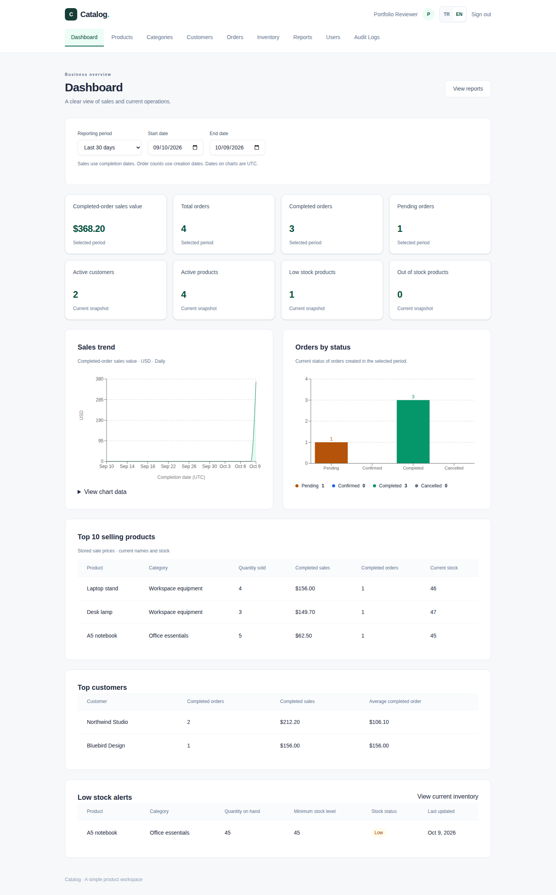
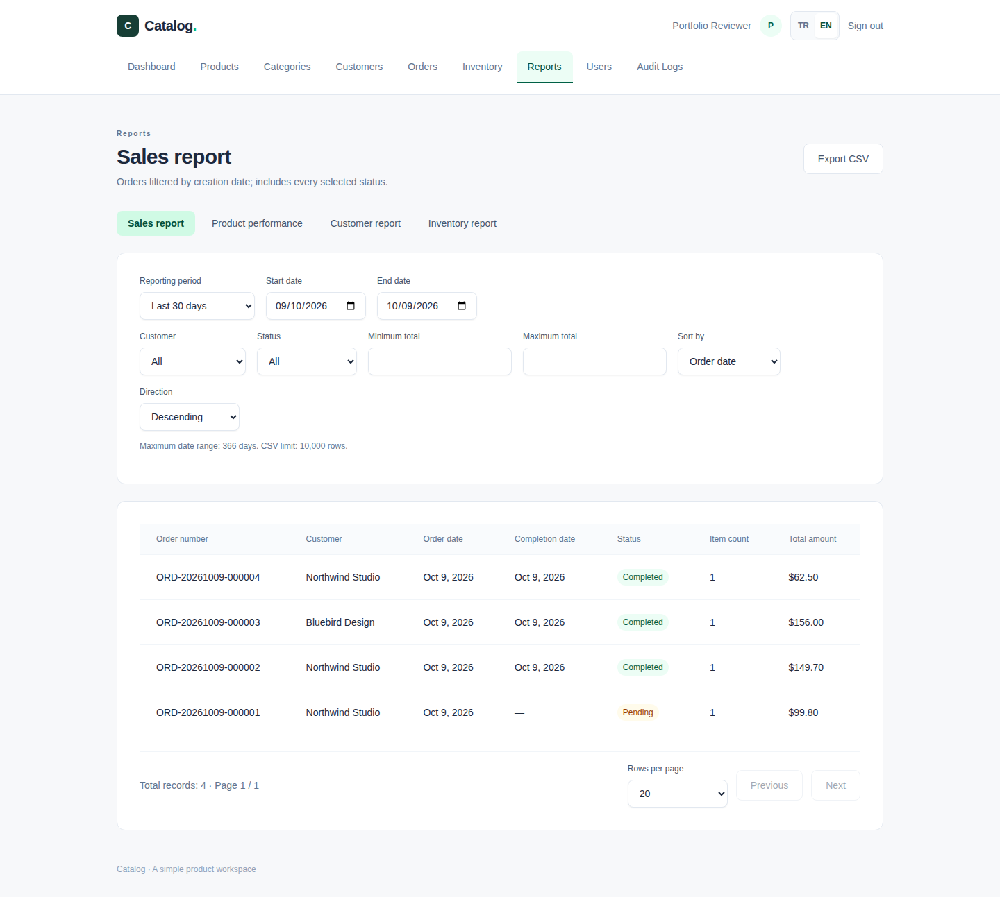
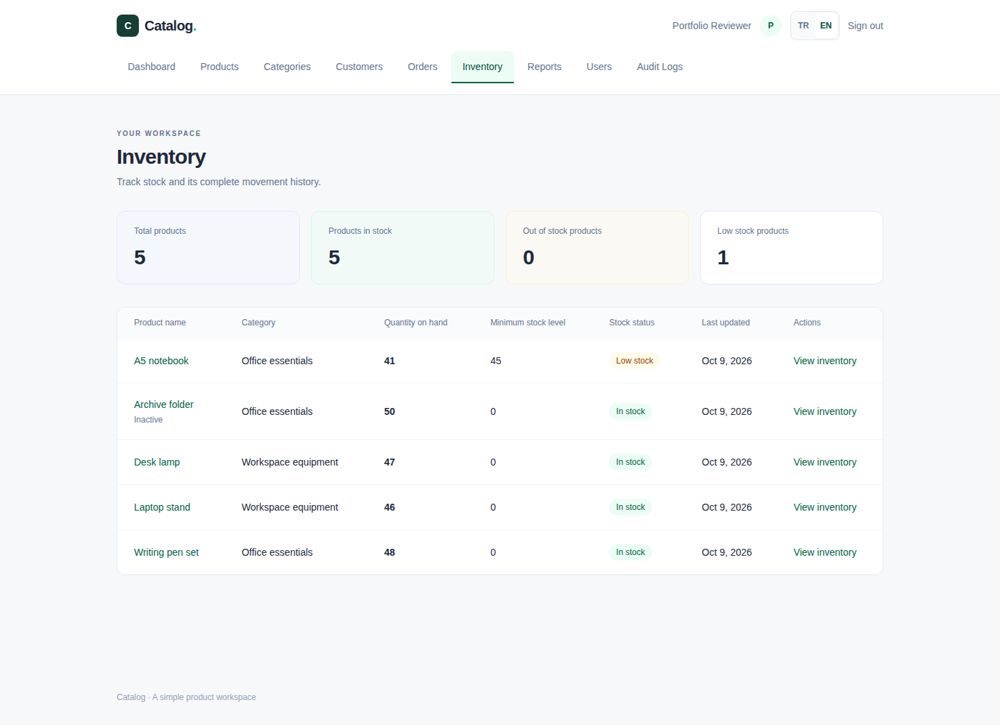
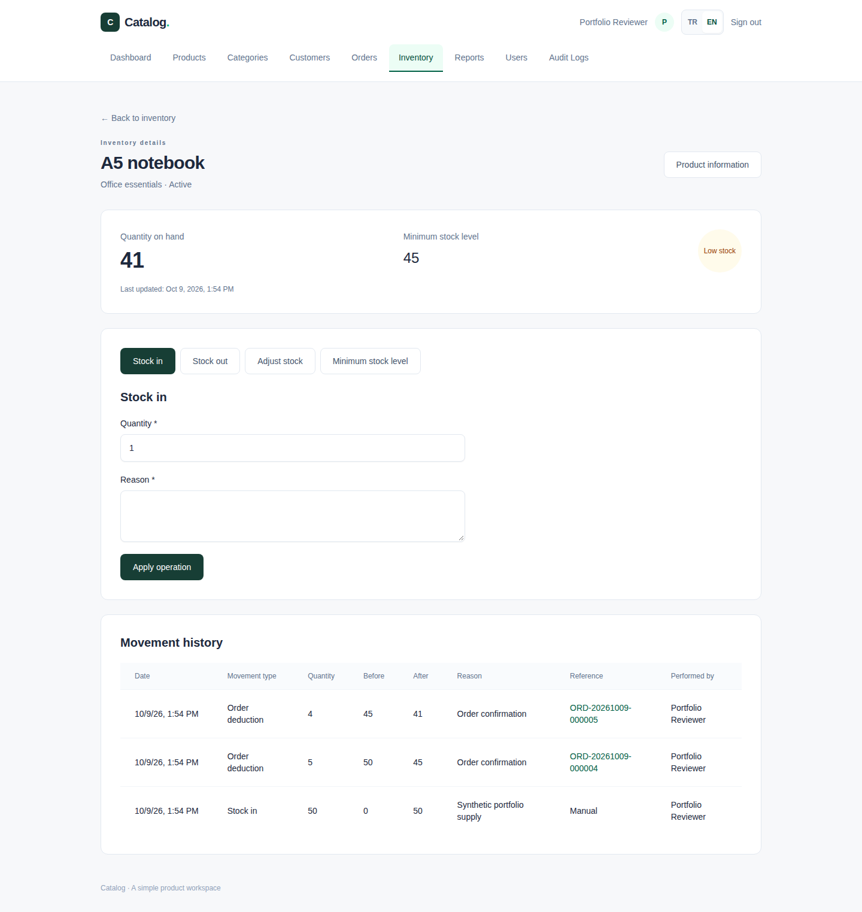
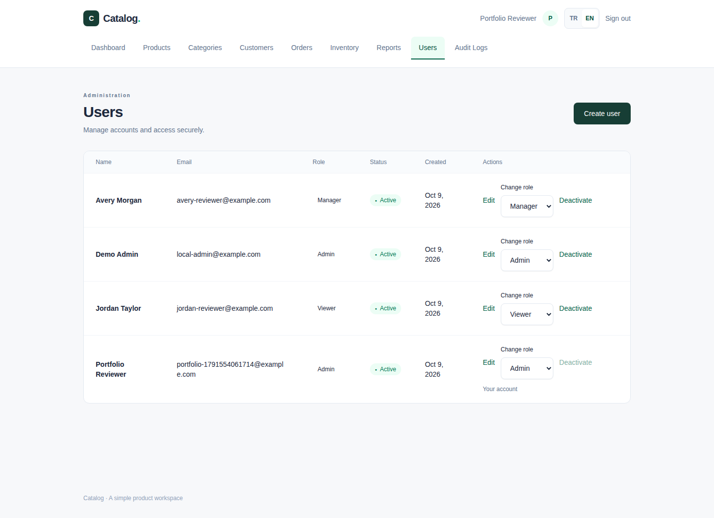
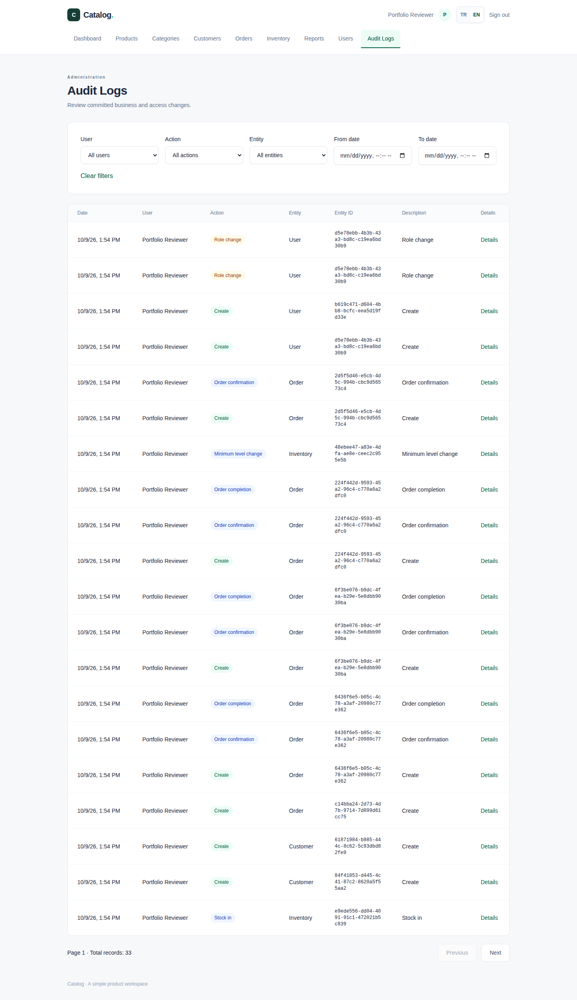
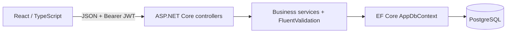
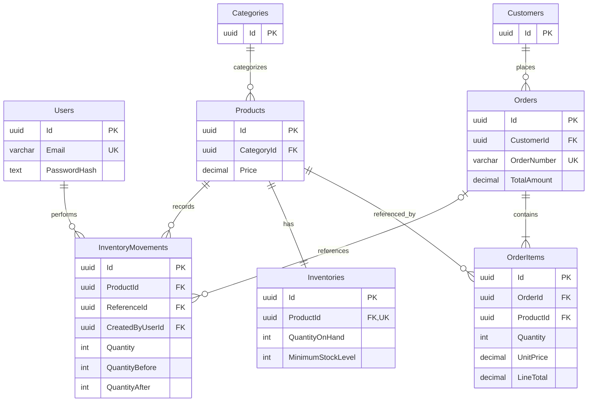
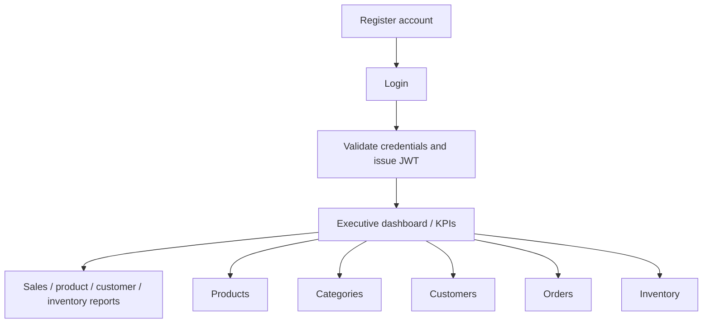

# DemoErp — Catalog business demo

A runnable full-stack engineering portfolio: register/sign in, manage products,
categories and customers, and create orders with prices calculated by the server.
Manage inventory through an immutable movement ledger, with stock deducted only
when orders are confirmed. The web interface switches between English and Turkish.

[Türkçe](README.tr.md) · [Architecture](docs/ARCHITECTURE.md) · [Database](docs/DATABASE.md) · [API](docs/API.md) · [Development](docs/DEVELOPMENT.md) · [Verification](VERIFICATION.md)

[Inventory rules, concurrency and interview talking points](docs/INVENTORY.md)

[Authorization matrix](docs/AUTHORIZATION.md) · [Security and Admin setup](docs/SECURITY.md) · [Audit logging](docs/AUDIT_LOGGING.md)

This source tree contains the complete standalone demo. Earlier commits describe a
different, private manufacturing ERP; its samples and visuals are superseded here.
The current application does not include manufacturing, barcode or desktop modules.
Verification includes builds, PostgreSQL integration tests and browser acceptance tests.

## Dashboard and reporting

Sign-in opens an executive dashboard with eight database-driven KPIs, UTC sales
trends, current order-status counts, top products/customers and low-stock alerts.
Four paginated, filtered reports export bounded UTF-8 CSV with formula protection.
Sales value means completed-order sales in USD, not accounting revenue. Completion
periods use nullable CompletedAt; legacy orders retain their unknown completion dates.
Stock and active-record counts remain explicitly current snapshots.

[Business definitions, API, dates and 10 interview questions](docs/REPORTING.md) ·
[Measured SQL plans and reproducible development dataset](docs/PERFORMANCE.md).
The isolated 20,000-order benchmark measured completed-sales totals at 1.456 →
0.325 ms and filtered orders at 2.739 → 0.631 ms (warm medians, seven samples).
These are database execution measurements on synthetic data, not production latency.
Two measured date indexes were added; no performance gain is claimed for unchanged
inventory/movement queries. See PERFORMANCE for seeding and reproduction commands.

## AI Business Assistant

The optional `/ai-assistant` page answers English/Turkish business questions through
the ASP.NET Core backend and official OpenAI .NET SDK. Nine fixed read-only tools
reuse reporting for completed sales, period comparisons, product/customer rankings,
order statuses, current pending orders, low/out-of-stock products and stock coverage
estimates. Customer ranking uses pseudonyms. Sources are attached by the server from
actual tool executions; totals, averages and changes are calculated in the backend.

Examples: “Summarize sales for the last 30 days”, “Which products have low stock?”
and “How many orders are pending?”. Every request checks BusinessRead and current
user state before each tool and final delivery. There is no arbitrary SQL, write
operation, document retrieval or persistent chat history. Answers may still be wrong;
verify the source reports. Each question is independent and conversation resets on reload.

**Disabled by default:** Docker and all ERP modules work without an AI API key.
Use the backend-only `AI_*` settings in `.env.example` when deploying an authorized
provider integration. Enabling OpenAI sends questions and selected minimized ERP
data outside the environment; review privacy, retention, residency and organizational
policy first. Do not paste secrets or personal data into questions. No VITE secret
variable or live paid API call is used by automated tests.

Default limits: 10 requests/user/minute, 100/user/UTC day, 2,000 input characters,
five tools over two tool rounds, ten rows per list, 1,000 output tokens per provider
response and a 30-second whole-request deadline. Quotas are in memory per API instance
and reset on restart; production needs deployment-level spend/shared quota controls.
Provider failures return safe errors without interrupting other ERP modules.

[AI architecture, configuration, tool matrix and 12 interview questions](docs/AI_ARCHITECTURE.md) ·
[AI security and provider data governance](docs/AI_SECURITY.md).
Run `dotnet test` for fake-model/PostgreSQL/SDK transport tests and the existing
Playwright suite for UI states; see [verification](VERIFICATION.md) for executed results
and the explicitly unverified live-provider smoke test.

## Features

- Registration, password hashing, JWT login and protected API/UI routes.
- Admin/Manager/Viewer policies, immediate role/account token revocation, one-time
  environment-based Admin provisioning and localized user management.
- Admin-only, filterable and paginated audit history with allowlisted JSON changes,
  actor snapshots, correlation IDs and transaction-consistent immutable records.
- Product, category and customer list/detail/create/edit/delete screens; active flags
  and reference protection for deletion. Every product belongs to a category.
- Orders with multiple distinct products, quantity validation, database price
  snapshots, transaction rollback and unique sequence-backed order numbers.
- Stock receipt/issue/adjustment, minimum levels, low-stock dashboard and immutable
  actor/reason/reference audit history. Every product starts with zero inventory.
- Transactional confirmation deducts stock; confirmed cancellation returns actual
  deductions. PostgreSQL row locks prevent overselling and duplicate processing.
- Pending → Confirmed → Completed status flow, with cancellation before completion.
- TR/EN navigation, forms, validation, dialogs, dates and number formatting; responsive
  mobile cards and accessible native confirmation dialogs.
- Persistent PostgreSQL data, committed migrations, one-command Docker startup and
  Development Swagger/OpenAPI.

## Screenshots

| Executive dashboard | Sales report |
| --- | --- |
|  |  |

[Turkish dashboard](docs/screenshots/dashboard-tr.png) ·
[Turkish inventory report](docs/screenshots/inventory-report-tr.png).


Real Chromium captures from the running application, using synthetic demo records
in a disposable PostgreSQL database. No production data is shown.

| English product workspace | Turkish order detail |
| --- | --- |
|  |  |

| Login | Order creation |
| --- | --- |
|  |  |

Additional captures: [categories](docs/screenshots/categories-en.png),
[customers](docs/screenshots/customers-en.png), [orders](docs/screenshots/orders-en.png),
[Turkish products](docs/screenshots/products-tr.png). [Capture procedure](docs/DEVELOPMENT.md#screenshots).

| Inventory dashboard | Inventory operations and audit |
| --- | --- |
|  |  |

[Turkish inventory](docs/screenshots/inventory-tr.png).

| User administration | Filterable audit history |
| --- | --- |
|  |  |

[Audit details](docs/screenshots/audit-detail-en.png) · [Turkish users](docs/screenshots/users-tr.png) · [Turkish audit history](docs/screenshots/audit-logs-tr.png).

## Tech stack

Frontend versions below are resolved from the committed npm lockfile; .NET packages
are explicit project references. Container tags are configured versions, not immutable
image digests.

| Area | Technology / version |
| --- | --- |
| Frontend | React 19.3.0, TypeScript 5.9.3, Vite 6.4.4, Tailwind CSS 4.3.3 |
| Routing / server state | React Router 7.18.4, TanStack Query 5.104.1 |
| Charts | Recharts 3.10.1, lazy-loaded reporting module |
| Forms / validation | React Hook Form 7.89.0, Zod 4.1.11; FluentValidation 12.1.1 |
| Backend | ASP.NET Core / .NET 10; verified SDK 10.0.401 |
| ORM / database | EF Core 10.0.12, Npgsql EF provider 10.0.3, PostgreSQL 17 |
| Authentication | JWT Bearer 10.0.12, HS256; Identity PBKDF2 password hasher |
| API documentation | Swashbuckle 10.3.0 |
| Backend tests | xUnit v3 package 4.0.1, ASP.NET testing 10.0.12, Testcontainers 4.15.0 |
| Browser tests | Playwright 1.63.0, Chromium |
| Containers | Docker Compose v2; SDK/ASP.NET 10, Node 22 Alpine, PostgreSQL 17 Alpine, unprivileged Nginx |
| CI | GitHub Actions: backend build/tests and frontend build; no deployment workflow |

## System architecture

One API project separates concerns through directories and scoped services; it does
not claim separate Application/Infrastructure projects.



See [architecture decisions](docs/ARCHITECTURE.md) and the source in
[controllers](backend/Demo.Api/Controllers), [services](backend/Demo.Api/Services),
[contracts](backend/Demo.Api/Contracts) and [data](backend/Demo.Api/Data).

## Database architecture



Users have no business-record ownership relationships; movements reference the
authenticated actor for auditing. ReferenceId is a nullable real Order FK.
API-created orders require
at least one line; this minimum is enforced by validation. Foreign keys protect
referenced category/customer/product records; order-item deletion cascades only
when an order is administratively deleted. [Full schema and migrations](docs/DATABASE.md).

## Application workflow

The authenticated landing page is `/dashboard`; the product workspace remains at
`/products`. Reports are available under `/reports` to every business-read role.

```mermaid
flowchart LR
  Customer[Select active customer] --> Product[Select active products]
  Product --> Quantity[Enter quantities]
  Quantity --> Validation[Server-side validation]
  Validation --> Price[Read database prices and calculate totals]
  Price --> Persist[Persist order and lines in one transaction]
  Persist --> Pending[Order created: Pending]
  Pending --> Confirm[User confirms order]
  Confirm --> Check[Lock order and inventory rows; check available stock]
  Check --> Deduct[Deduct stock and record movements in one transaction]
  Deduct --> Confirmed[Commit status: Confirmed]
```





Browser totals are previews. Order creation accepts only customer/product IDs and
quantities; the API calculates prices/totals. Stored unit prices do not change when
product prices change. Product/customer names remain live references.

## API

Default base URL: http://localhost:5080/api. Business endpoints require Bearer JWT.

| Module | Endpoints | Authentication |
| --- | --- | --- |
| Auth | POST /auth/register, POST /auth/login | Public; rate limited |
| Products | GET/POST /products; GET/PUT/DELETE /products/{id} | Bearer |
| Categories | GET/POST /categories; GET/PUT/DELETE /categories/{id} | Bearer |
| Customers | GET/POST /customers; GET/PUT/DELETE /customers/{id} | Bearer |
| Orders | GET/POST /orders; GET /orders/{id}; PUT /orders/{id}/status | Bearer |
| Inventory | GET /inventory; GET /inventory/{productId}; GET /inventory/{productId}/movements | Bearer |
| Stock operations | POST /inventory/{productId}/stock-in, /stock-out, /adjust; PUT /inventory/{productId}/minimum-level (same product prefix) | Bearer |
| Users | GET/POST /users; GET/PUT /users/{id}; PUT /users/{id}/role, /status | Admin |
| Audit logs | GET /audit-logs; GET /audit-logs/{id}; server filters/pagination | Admin |
| Health | GET /health (outside /api) | Public |

[Detailed endpoint contracts](docs/API.md) · [Local Swagger](http://localhost:5080/swagger).
There is no order-delete, refresh-token or server logout endpoint.

## Getting started

Requires Docker Desktop with Linux containers, or Docker Engine with Compose v2.

```sh
git clone https://github.com/SCanerG/DemoErp.git
cd DemoErp
# Optional: copy .env.example to .env and customize development settings.
docker compose up --build
```

Development defaults work without a .env file or host SDK. The example contains
clearly marked local placeholders; never use these as production credentials.
Public registration creates a read-only Viewer. To manage business data, copy
.env.example to ignored .env and supply BOOTSTRAP_ADMIN_ENABLED=true plus your own
BOOTSTRAP_ADMIN_NAME, BOOTSTRAP_ADMIN_EMAIL and BOOTSTRAP_ADMIN_PASSWORD. No working
Admin credentials or business data are seeded. After the first successful startup,
disable bootstrap, remove its password and recreate the API. Use Admin user management
to create Manager/Viewer accounts. [Exact setup and restart behavior](docs/SECURITY.md#one-time-initial-admin-provisioning).

| Service | URL |
| --- | --- |
| Frontend | http://localhost:3000 |
| Swagger / OpenAPI | http://localhost:5080/swagger / http://localhost:5080/swagger/v1/swagger.json |
| Health | http://localhost:5080/health |

PostgreSQL is internal to Compose. Health checks order startup and the API applies
migrations automatically. `docker compose down` retains the database volume;
`docker compose down -v` deletes it. [Environment variables and local development](docs/DEVELOPMENT.md).

## Engineering decisions

- Scoped services/DbContext keep HTTP handling, business rules and persistence clear
  within one API project. Explicit DTOs omit hashes and persistence internals.
- FluentValidation is authoritative; Zod gives browser feedback. Database constraints
  enforce uniqueness, foreign keys and numeric invariants under concurrency.
- EF read projections and AsNoTracking avoid tracking overhead and per-item queries.
- Repeatable-read order transactions prevent partial writes; PostgreSQL sequence
  allocation and a unique index provide concurrent order-number safety.
- Status transitions use ReadCommitted with an order row lock and deterministically
  ordered inventory locks; all stock, audit and status changes commit or roll back
  together. Immutable ledger entries and a unique order-movement index prevent
  duplicate deductions/returns. [Precise concurrency strategy](docs/INVENTORY.md#postgresql-concurrency-and-transactions).
- JWT validates issuer, audience, signature and expiry. Passwords are salted PBKDF2
  hashes. Session expiry/401 clears browser state; logout does not revoke JWTs.
- Every protected request verifies the current role/active flag/SecurityVersion in
  PostgreSQL. User security changes use an advisory transaction lock and recheck
  the Admin after waiting. Audit inserts commit with their related business changes.
- Localization uses one dictionary and a React subscription, with storage fallback.
- Errors return safe ProblemDetails and trace IDs; structured logs avoid sensitive
  request/SQL values. [Details and tradeoffs](docs/ARCHITECTURE.md).

## Testing

.NET 10 SDK and running Docker are required for PostgreSQL integration tests:

```sh
dotnet build Catalog.slnx
dotnet test
cd frontend
npm ci
npm run build
npx playwright install chromium
npm run test:e2e
```

Browser tests require a disposable running stack and provided test Admin credentials.
Docker Chromium is also supported;
see [development commands](docs/DEVELOPMENT.md). The backend suite covers auth,
CRUD, validation, reference protection, concurrency, transactions and legacy migration
upgrade. Browser tests cover complete business workflows, TR/EN switching, mobile
layouts, dialogs, storage failures and query/session error cases.

Phase 3 PostgreSQL tests also cover inventory constraints/triggers, quantity and reason
validation, immutable audit history, shortage/overflow rollback, legacy backfill,
duplicate transitions, multi-product atomicity and competing confirmations/adjustments.

Executed checks and their limits are recorded in [VERIFICATION.md](VERIFICATION.md).
The CI workflow uses the same build/test commands. The previously published baseline's
backend and frontend jobs passed on GitHub Actions; Phases 3–5 remote CI are unverified until publication.
See the [workflow runs](https://github.com/SCanerG/DemoErp/actions/workflows/ci.yml)
and [publication verification](VERIFICATION.md#publication-verification--8-october-2026).

## Known limitations

Business data is shared; there are no tenants, per-user ownership, pagination on the original CRUD lists (reports and audit logs are paginated),
refresh tokens/per-token revocation, password recovery, stock reservations, valuation, taxes, discounts
or payments. Most record edits use last write wins; order status changes are serialized
with database row locks.
Only unit prices are snapshots. Currency is USD. No production deployment, load
test, cross-browser certification or cross-platform certification is claimed.
Future improvements are not presented as implemented functionality.

## Reuse

Published for technical evaluation. No open-source license is granted; see
[NOTICE](NOTICE.md). Author: [SCanerG](https://github.com/SCanerG).
