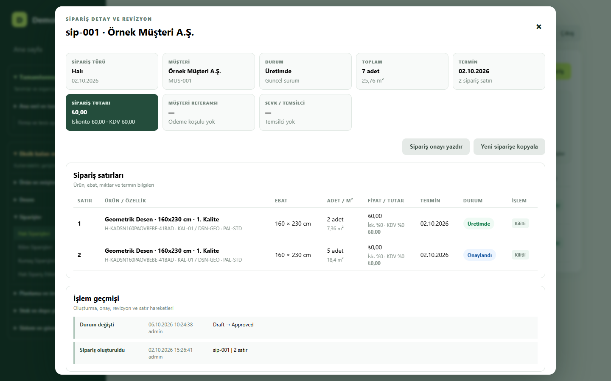
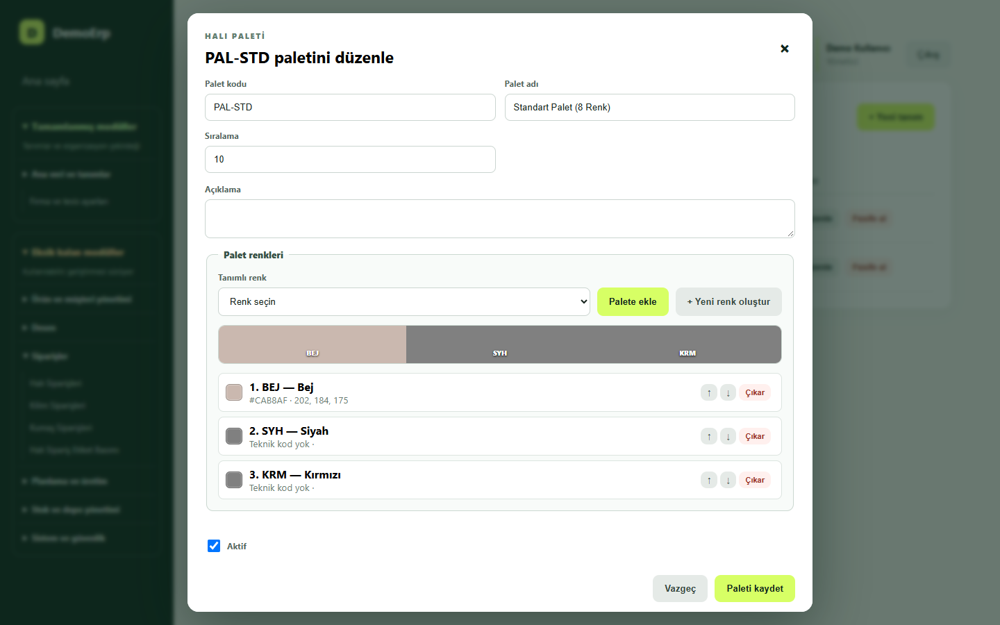
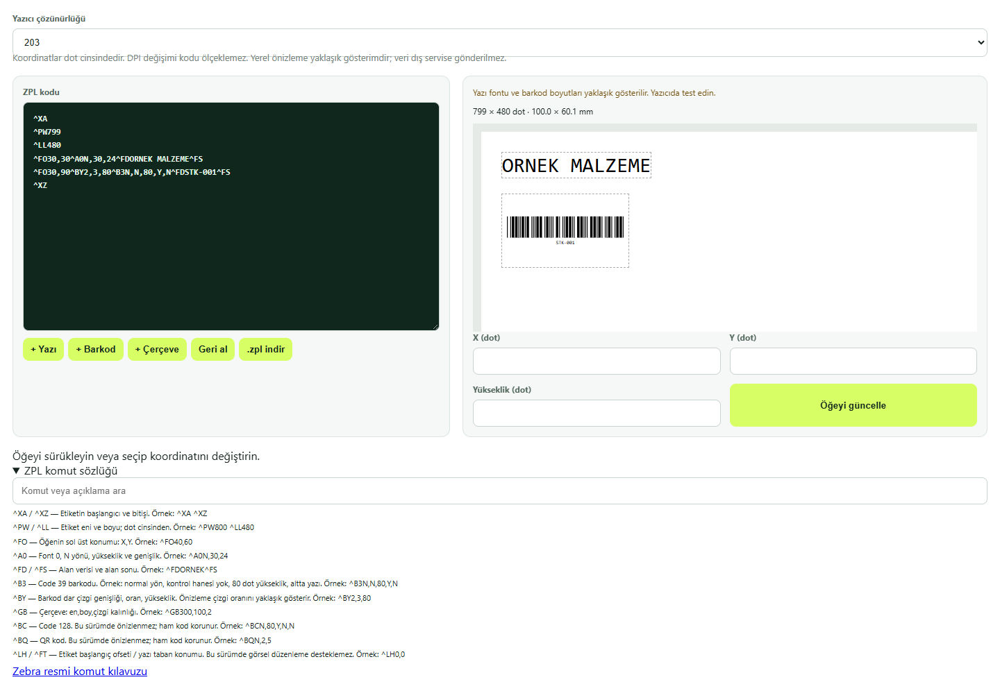
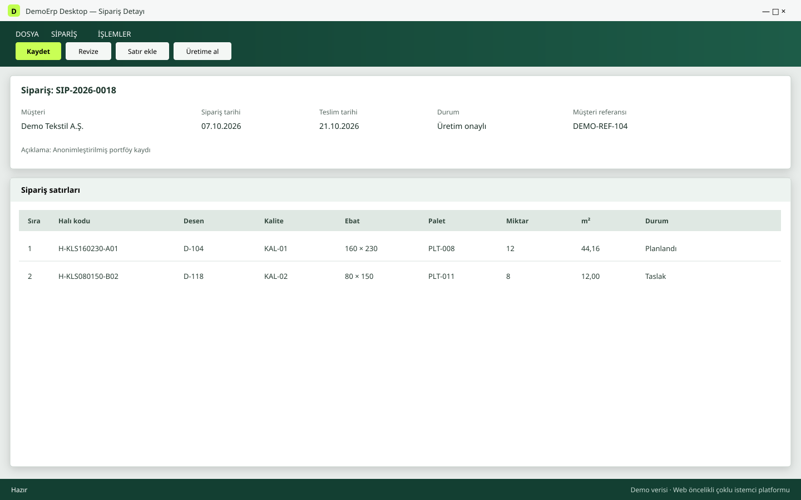
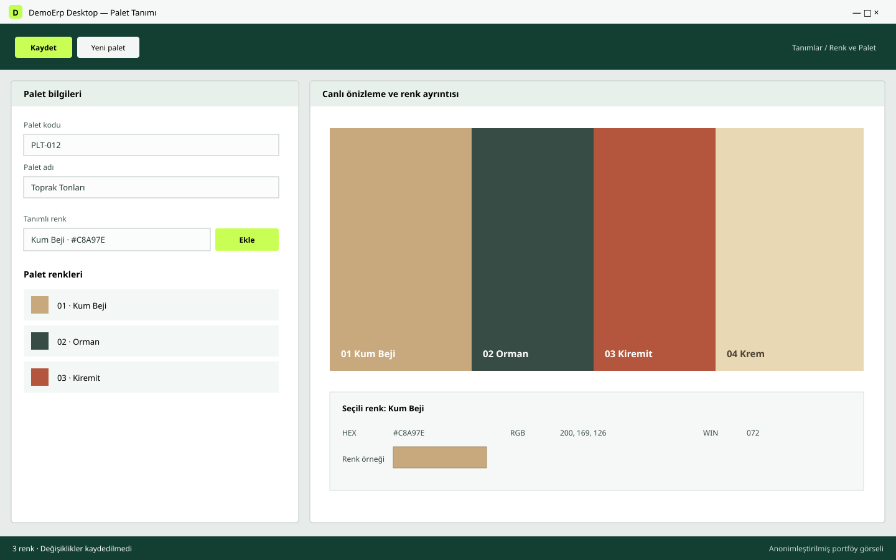
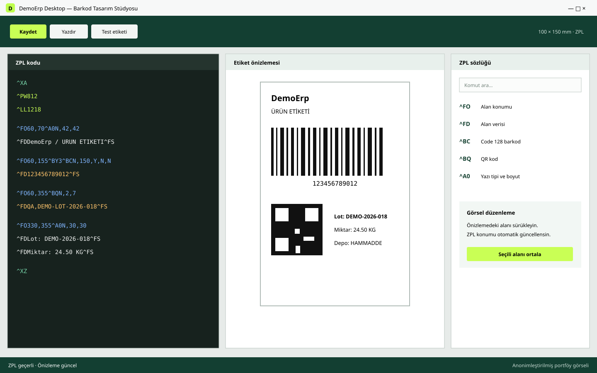

# DemoErp
### Manufacturing ERP / MRP · Full-stack engineering portfolio

**C# · ASP.NET Core 9 · EF Core 9 · PostgreSQL · JWT · JavaScript SPA · Docker**

[Türkçe](#türkçe) · [English](#english) · [Reviewer guide](docs/REVIEWER_GUIDE.md) · [Architecture](docs/ARCHITECTURE.md) · [Verification](docs/VERIFICATION.md)

## 60 saniyelik inceleme yolu / 60-second reviewer path

### Türkçe

1. Aşağıdaki gerçek web uygulaması ekranlarını ve Windows istemci görsellerini inceleyin.
2. [Mimari ve güvenlik kararlarına](docs/REVIEWER_GUIDE.md) göz atın.
3. [Seçilmiş kod örneklerini](docs/CODE_EXAMPLES.md) inceleyin.
4. Bilinçli olarak küçük tutulan [.NET 9 örneğini](samples/DemoErp.Sample) çalıştırın.
5. [Public yayın sınırlarını](docs/PUBLICATION_SCOPE.md) okuyun.

Bu depo dağıtılabilir bir ERP paketi değil, teknik portföydür. Tam domain implementasyonunu, veritabanlarını ve operasyonel entegrasyonları gizli tutarken ürün ve mühendislik yaklaşımını incelenebilir örneklerle gösterir.

### English

1. Review the real web-application screens and Windows-client visuals below.
2. Inspect the [architecture and security decisions](docs/REVIEWER_GUIDE.md).
3. Review the [selected code examples](docs/CODE_EXAMPLES.md).
4. Run the deliberately small [.NET 9 sample](samples/DemoErp.Sample).
5. Read the [publication boundary](docs/PUBLICATION_SCOPE.md).

This repository is a technical portfolio, not a distributable ERP package. It presents reviewable product and engineering examples while keeping the complete domain implementation, databases and operational integrations private.

## Application showcase / Uygulama vitrini

The web screenshots below were captured from the running application on localhost with demo data. Windows visuals document the prepared desktop client experience. No customer records, production designs or machine configuration are published.

### Web client / Web istemcisi — real application captures

| Order detail / Sipariş detayı | Palette and color preview / Palet ve renk önizleme | ZPL barcode designer / Barkod tasarımı |
|---|---|---|
| [](docs/screenshots/web-order-detail.png) | [](docs/screenshots/web-palette-color-preview.png) | [](docs/screenshots/web-barcode-designer.png) |

### Windows client / Windows istemcisi

| Order detail / Sipariş detayı | Palette and color preview / Palet ve renk önizleme | ZPL barcode designer / Barkod tasarımı |
|---|---|---|
| [](docs/screenshots/windows-order-detail.svg) | [](docs/screenshots/windows-palette-color-preview.svg) | [](docs/screenshots/windows-barcode-designer.svg) |

## Multi-client platform / Çoklu istemci platformu

DemoErp is designed around one protected ASP.NET Core REST API and shared JWT identity contracts:

- **Web:** reference client and current delivery priority
- **Windows desktop:** prepared for workstation and shop-floor workflows
- **Android:** prepared for portable operational workflows

Feature coverage can differ by operating scenario. New capabilities are delivered to the web reference client first; the clients share backend authorization and business contracts rather than duplicating security rules in the UI.

DemoErp; ortak ASP.NET Core REST API ve JWT kimlik sözleşmeleri etrafında geliştirilir. Web, Windows masaüstü ve Android istemcileri hazırlanmıştır. Referans istemci ve güncel teslimat önceliği web uygulamasıdır; özellik kapsamı kullanım senaryosuna göre farklılaşabilir.

## Türkçe

DemoErp, halı, iplik ve kumaş süreçlerine yönelik geliştirilen bir üretim yönetim projesidir. İşe alım incelemesi için odak noktası tek bir akıştır: **giriş → yetkilendirilmiş API → ürün kartı CRUD → kalıcı veri → çıkış**.

Bu public depo teknik dokümantasyon ve seçilmiş, çalıştırılabilir C# örnekleri içerir. Tam MRP uygulaması, kimlik doğrulama uygulaması ve veritabanı dağıtımı bu depoda yayınlanmaz. Aşağıdaki ürün özellikleri özel çalışma alanındaki implementasyonu anlatır; public örneğin yetenekleri ayrıca belirtilmiştir.

### Mevcut teknoloji yığını

| Alan | Uygulanan teknoloji |
|---|---|
| Backend | C#, .NET 9, ASP.NET Core Minimal API |
| Mimari | API, Application, Domain, Infrastructure; use case ve repository ayrımı |
| Veri | EF Core 9, Npgsql, PostgreSQL 17, migration ve başlangıç verileri |
| Web | HTML, CSS, vanilla JavaScript SPA, hash tabanlı korunan rotalar |
| Kimlik | JWT access token, HttpOnly refresh cookie, token rotasyonu, rol politikaları |
| Doğrulama | Request DTO doğrulaması ve Domain iş kuralları |
| Hatalar | Global exception handling, Problem Details ve trace ID |
| Dağıtım | Docker, Docker Compose, kalıcı PostgreSQL volume |
| İstemciler | Web referans istemci; Windows masaüstü ve Android istemcileri hazırlanmış durumda |

SQLite, test ve eski veri aktarımı desteği olarak bulunur. Varsayılan uygulama veritabanı PostgreSQL'dir.

### İncelenecek temel akış

1. İlk kurulumda yönetici hesabı oluşturulur; sonraki kullanıcıları yönetici açar.
2. Login, kısa ömürlü JWT ve HttpOnly refresh cookie üretir.
3. Kullanıcı ürün/malzeme kartlarını listeler, oluşturur, görüntüler ve günceller.
4. Silme isteği, stok ve kullanım kurallarını denetleyerek kartı pasife alır.
5. Access token süresi dolduğunda istemci yenileme yapar; logout refresh tokenı iptal edip cookie'leri temizler.

Halı, iplik ve kumaş iş alanındaki ürünlerdir. Teknik halı kartları ayrı özellikler taşır; örnek CRUD mevcut ürün/malzeme kartlarını kullanır. Bu katalogda hayali fiyat veya açıklama alanları gösterilmez.

| İşlem | Gerçek API yolu |
|---|---|
| İlk yönetici kurulumu | `POST /api/auth/setup` |
| Giriş / yenileme / çıkış | `POST /api/auth/login`, `/refresh`, `/logout` |
| Liste / detay | `GET /api/inventory/items`, `GET /api/inventory/items/{id}` |
| Oluştur / güncelle | `POST /api/inventory/items`, `PUT /api/inventory/items/{id}` |
| Pasife al | `DELETE /api/inventory/items/{id}` |

Self-service `/register` endpointi yoktur. Web rotaları `#product-cards` ve `#carpet-products` biçimindedir; oluşturma ve düzenleme formları bu ekranlardan açılır.

### Güvenlik davranışı

Access token varsayılan 15 dakika, refresh token 7 gün geçerlidir. İstemci access tokenı bellekte tutar; aynı origin ve masaüstü uyumluluğu için access cookie de vardır. Refresh cookie HttpOnly ve SameSite=Strict'tir; HTTPS dağıtımında Secure etkinleştirilmelidir. Refresh tokenın yalnızca SHA-256 özeti veritabanına yazılır. Yenilemede token değiştirilir ve eskisi iptal edilir.

API, JWT imzasını, issuer, audience ve süreyi doğrular; yazma işlemlerinde rol kontrolü uygular. Frontend route guard kullanıcı deneyimini yönetir; erişim güvenliği backend tarafından sağlanır. Logout mevcut refresh tokenı iptal eder; önceden alınmış access tokenın süresi dolmadan sunucuda anında iptali henüz uygulanmamıştır.

### Çalıştırma ve doğrulama sınırı

Public örnek .NET 9 SDK ile çalışır:

```sh
dotnet run --project samples/DemoErp.Sample -- --self-test
dotnet run --project samples/DemoErp.Sample -- --urls http://localhost:5095
```

`POST /samples/size/validate` için örnek istek:

```json
{"widthCm":160,"lengthCm":230,"shape":"Rectangle"}
```

Örnek; Minimal API, request/response sözleşmesi ve ebat iş kurallarını gösterir. JWT, ürün CRUD, EF Core veya Docker içermez.

Tam uygulamada gerekli environment sırları hazırlandıktan sonra `docker compose up --build` web/API ve PostgreSQL'i başlatacak şekilde yapılandırılmıştır. Web/API adresi `http://localhost:5080` olur. Public depo tam uygulamayı içermez; burada bu komutla ERP başlatılamaz. Compose doğrulandı; gerçek Docker/PostgreSQL çalıştırma kabul testi henüz raporlanmamıştır.

### Planlanan gelişmeler

React, TypeScript ve Vite tabanlı istemci; React Router, TanStack Query, React Hook Form, Zod ve Tailwind CSS değerlendirmesi; .NET 10 geçişi; FluentValidation değerlendirmesi; OpenAPI/Swagger dokümantasyonu. Bunlar mevcut tech stack değildir.

Öncelik, auth ve ürün CRUD akışını gerçek PostgreSQL üzerinde doğrulamak, refresh/replay ve oturum iptali testlerini genişletmek ve frontend modüllerini ayırmaktır. Ayrı frontend/backend klasör düzeni bu geçişle değerlendirilecektir.

## English

DemoErp is a manufacturing ERP/MRP project covering carpet, yarn and fabric workflows. Its recruitment presentation focuses on **login → authorized API → product-card CRUD → persistent data → logout**.

This public repository contains documentation and selected executable C# samples. The complete application, authentication implementation and database deployment remain private. The implementation described here belongs to that private application, not to the small public sample.

### Implemented stack and flow

The application uses C#, ASP.NET Core 9 Minimal APIs, EF Core 9, Npgsql and PostgreSQL 17. API, Application, Domain and Infrastructure projects separate HTTP handling, use cases, business rules and persistence. The current web client is an HTML/CSS/vanilla JavaScript SPA with protected hash routes; React and TypeScript migration is planned. Windows desktop and Android clients are prepared around the same protected API contracts. Docker Compose defines web/API hosting and persistent PostgreSQL storage.

The first administrator is created through `POST /api/auth/setup`; administrators provision subsequent users. There is no public self-registration endpoint. Login returns a short-lived JWT and sets an HttpOnly refresh cookie. The browser renews expired access tokens and retries a request once. Backend role policies enforce write permissions independently of the UI.

Product/material cards expose list, detail, create, update and soft-delete operations at `/api/inventory/items`. Responses use `ProductCardDto`; business rules prevent deactivation when stock or open usage exists. Carpet technical cards retain their specialized model. Existing manufacturing products provide the CRUD example.

Access tokens default to 15 minutes and refresh tokens to seven days. Refresh tokens are hashed in storage and rotated on renewal. Logout revokes the current refresh token and clears cookies; immediate server-side revocation of previously issued access tokens is not implemented. Request validation, global Problem Details handling, provider-specific migrations and seed data are present.

### Implementation status and roadmap

Start with the [sample project](samples/DemoErp.Sample/DemoErp.Sample.csproj), [API example](samples/DemoErp.Sample/Program.cs) and [domain rule](samples/DemoErp.Sample/SizeRule.cs). Run the two commands above to inspect the public sample; it demonstrates size validation, not the private authentication or persistence implementation.

Local solution builds, MRP regressions and an isolated SQLite HTTP smoke test passed. The smoke test covered JWT login/renewal/logout, authorized API access, role checks and product CRUD. PostgreSQL migration snapshots and Compose configuration were checked. A real PostgreSQL/Docker acceptance run and comprehensive security/browser tests remain outstanding.

React, TypeScript, Vite, React Router, TanStack Query, React Hook Form, Zod, Tailwind CSS, .NET 10, FluentValidation and Swagger are proposed upgrades, not claims about today's implementation. No Redis, Kafka, event bus or additional architectural framework is required for the review flow.

For the full private application, Compose is configured for `docker compose up --build` after environment secrets are supplied, serving web/API at `http://localhost:5080`. That deployment cannot be launched from this limited public repository.

## Publication / Yayın kapsamı

No complete ERP source, customer data, database files, credentials, original designs or operational machine integrations are published. AI-assisted tools are used during development. See [NOTICE](NOTICE.md) for reuse terms.

**Author / İletişim:** [SCanerG](https://github.com/SCanerG)
