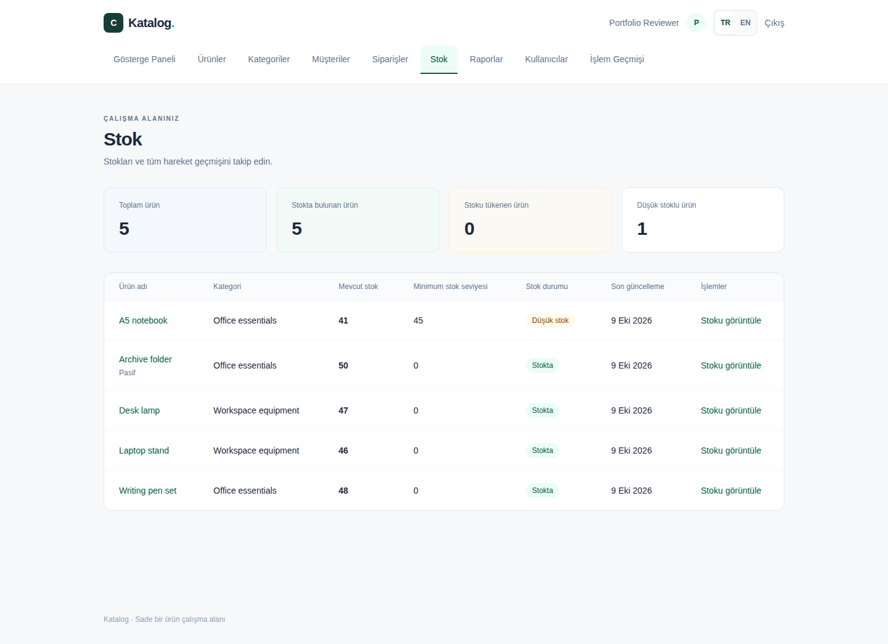

# DemoErp — Katalog iş uygulaması

[English README](README.md) · [Mimari](docs/ARCHITECTURE.md) · [Veritabanı](docs/DATABASE.md) · [API](docs/API.md) · [Geliştirme](docs/DEVELOPMENT.md)

Çalıştırılabilir full-stack portföy projesi: hesap oluşturma/giriş, ürün, kategori ve
müşteri yönetimi, sunucuda fiyatı hesaplanan çok kalemli siparişler. Arayüz anında
Türkçe/İngilizce değişir; dil tercihi saklanır ve mobil listeler kartlara dönüşür.
Uygulama gerçek PostgreSQL entegrasyon testleri ve Chromium tarayıcı testlerinden
geçirildi.

Bu kaynak ağacı bağımsız demonun tamamını içerir. Eski commitlerde anlatılan özel
üretim ERP’si, Windows/Android istemcileri ve barkod modülleri bu uygulamanın parçası
değildir. Eski geçmiş korunur; güncel README mevcut kodu anlatır.

## Gösterge paneli ve raporlar

Girişten sonra sekiz gerçek veri kartı, satış eğilimi, sipariş durum dağılımı, en çok
satan ürünler/müşteriler ve düşük stok uyarıları gösterilir. Satış, ürün performansı,
müşteri ve stok raporları sunucuda filtrelenir, sıralanır ve sayfalanır. Dört raporun
CSV çıktısı yetki kontrolü, UTF-8 BOM, formül koruması ve 10.000 satır sınırı içerir.

Satış değeri tamamlanan siparişlerin kayıtlı USD tutarıdır; muhasebeleştirilmiş gelir
olarak sunulmaz. Tamamlanma tarihi bilinmeyen eski siparişlere tarih uydurulmaz.
Stok ve aktif kayıt kartları güncel durumu gösterir. Tarih aralıkları yerel takvimden
UTC'ye çevrilir, başlangıç dahil ve bitiş hariç tutulur.

[Rapor tanımları ve teknik soru-cevaplar](docs/REPORTING.md) ·
[Gerçek sorgu planları, örnek veri ve ölçümleri tekrarlama](docs/PERFORMANCE.md).
İzole 20.000 siparişli veride satış toplamı 1,456 → 0,325 ms, filtreli sipariş listesi
2,739 → 0,631 ms ölçüldü (ısınmış önbellek, yedi çalıştırma medyanı). Bunlar üretim
API gecikmesi değildir. Stok/hareket sorguları için iyileşme iddia edilmez.

## Yapay Zekâ İş Asistanı

`/ai-assistant` sayfası, Türkçe/İngilizce işletme sorularını ASP.NET Core backend ve
resmi OpenAI .NET SDK üzerinden işler. Dokuz sabit, salt okunur araç mevcut raporları
kullanır: tamamlanan satışlar, önceki dönem karşılaştırması, ürün/müşteri sıralaması,
sipariş durumları, bekleyen siparişler, kritik/tükenmiş stok ve stok yeterlilik tahmini.
Müşteriler takma kimlikle gösterilir; toplam, ortalama ve değişimler sunucuda hesaplanır.
Kaynak bağlantıları yalnızca gerçekten çalıştırılan araçlardan sunucuda oluşturulur.

Örnekler: “Son 30 günün satışlarını özetle”, “Hangi ürünlerin stoğu kritik?” ve
“Kaç sipariş beklemede?”. Her araç çağrısından ve yanıt tesliminden önce güncel
oturum/yetki kontrol edilir. SQL üretimi, kayıt değiştirme, belge arama ve kalıcı
sohbet geçmişi yoktur. Her soru bağımsızdır; sayfa yenilendiğinde sohbet sıfırlanır.
Yanıtlar hatalı olabilir; rakamları kaynak raporlardan doğrulayın.

Özellik varsayılan olarak kapalıdır; Docker ve ERP modülleri AI anahtarı olmadan
çalışır. Yetkili kurulum için `.env.example` içindeki backend `AI_*` ayarları kullanılır.
VITE değişkenine anahtar koymayın. OpenAI etkinleştirilirse soru ve seçilen rapor
verileri ortam dışına gönderilir; veri sınıflandırması, sağlayıcı saklama/işleme,
coğrafi konum ve kurum politikaları ayrıca değerlendirilmelidir.

Varsayılan sınırlar: kullanıcı başına dakikada 10/günde 100 istek, 2.000 karakter soru,
iki araç turunda en fazla beş çağrı, listelerde 10 satır, sağlayıcı yanıtı başına 1.000
çıktı token’ı ve toplam 30 saniye. Kota tek API sürecinin belleğindedir, yeniden
başlatıldığında sıfırlanır. Üretimde ortak kota ve sağlayıcı harcama kontrolleri gerekir.

[AI mimarisi, yapılandırma ve 12 teknik soru-cevap](docs/AI_ARCHITECTURE.md) ·
[AI güvenlik ve veri yönetişimi](docs/AI_SECURITY.md) · [Çalıştırılan doğrulamalar](VERIFICATION.md).
Testler sahte model, gerçek PostgreSQL ve ağsız resmi SDK taşıma testleri kullanır;
normal CI ücretli canlı sağlayıcı çağrısı yapmaz.

## Uygulanan özellikler

- PBKDF2 parola özeti, JWT giriş ve korunan API/arayüz rotaları.
- Admin/Manager/Viewer politikaları, rol/aktiflik değişikliğinde eski token’ın iptali,
  güvenli ilk yönetici kurulumu ve kullanıcı yönetimi.
- Yöneticiye özel filtreli/sayfalı işlem geçmişi; aynı transaction’da tutulan
  kullanıcı, önce/sonra alanları ve izleme kimliği içeren değiştirilemez kayıtlar.
- Ürün/kategori/müşteri CRUD, aktiflik ve ilişkili kayıtların silinmesini engelleme.
- Zorunlu ürün kategorisi; aktif müşteri/ürünlerle çok kalemli sipariş.
- Sunucudan alınan fiyatlar, fiyat anlık görüntüsü, tek transaction ve benzersiz numara.
- Ürün başına stok, giriş/çıkış/düzeltme, minimum seviye, düşük stok göstergeleri
  ve değiştirilemeyen kullanıcı/gerekçe/sipariş bağlantılı hareket geçmişi.
- Sipariş onayında atomik stok düşümü, onaylı sipariş iptalinde gerçek düşümlerin
  iadesi; PostgreSQL satır kilitleriyle eşzamanlı aşırı satış ve mükerrer işlem koruması.
- Bekliyor → Onaylandı → Tamamlandı; tamamlanmadan önce iptal.
- Türkçe/İngilizce formlar, hata mesajları, tarih/sayı biçimleri ve mobil görünüm.
- Kalıcı PostgreSQL, otomatik migration, Docker Compose ve Swagger.




[Stok kuralları, transaction ve eşzamanlılık açıklaması](docs/INVENTORY.md).

[Yetki matrisi](docs/AUTHORIZATION.md) · [Güvenlik ve Admin kurulumu](docs/SECURITY.md) · [İşlem geçmişi](docs/AUDIT_LOGGING.md).

[Türkçe kullanıcı yönetimi](docs/screenshots/users-tr.png) · [Türkçe işlem geçmişi](docs/screenshots/audit-logs-tr.png).

## Teknoloji ve yapı

React 19.3.0, TypeScript 5.9.3, Vite 6.4.4, Tailwind 4.3.3; ASP.NET Core/.NET 10,
EF Core 10.0.12, Npgsql 10.0.3, PostgreSQL 17, FluentValidation 12.1.1 ve JWT.
Tam sürüm tablosu ve Mermaid mimari/ER diyagramları [İngilizce README](README.md)'dedir.

Tek API projesinde controller → servis → scoped DbContext → PostgreSQL akışı vardır.
Ayrı Application/Infrastructure assembly’leri yoktur. Kullanıcılar kimlik doğrular;
iş kayıtları kullanıcıya ait değildir ve oturum açanlar arasında paylaşılır.
DTO projeksiyonları parola özetlerini dışarı çıkarmaz; salt okunur sorgular
AsNoTracking kullanır. Sipariş fiyat/tutarları tarayıcıdan kabul edilmez.

## Çalıştırma

Linux container modunda Docker Desktop veya Docker Engine + Compose v2 gerekir.

```sh
git clone https://github.com/SCanerG/DemoErp.git
cd DemoErp
docker compose up --build
```

İstersen .env.example dosyasını .env olarak kopyalayıp geliştirme ayarlarını
değiştir. Örnek değerler yalnız yerel demo içindir; gerçek sırları Git’e ekleme.
Arayüz http://localhost:3000, Swagger http://localhost:5080/swagger adresindedir.
Herkese açık kayıt salt okunur Viewer oluşturur. İlk yönetici için Git dışında kalan
.env dosyasına BOOTSTRAP_ADMIN_ENABLED=true ve kendi BOOTSTRAP_ADMIN_NAME,
BOOTSTRAP_ADMIN_EMAIL, BOOTSTRAP_ADMIN_PASSWORD değerlerini yaz. İlk başarılı
başlangıçtan sonra bootstrap’ı kapat, parolayı kaldır ve API’yi yeniden oluştur.
Admin ekranından Manager/Viewer hesapları oluşturabilirsin. Hazır parola veya iş verisi
ekilmez. [Kurulum ayrıntıları](docs/SECURITY.md#one-time-initial-admin-provisioning). Migration otomatik
uygulanır. `docker compose down` veriyi korur; `down -v` veriyi siler.

## Doğrulama ve sınırlar

Backend için .NET 10 SDK ve çalışan Docker ile `dotnet build Catalog.slnx`,
`dotnet test`; frontend klasöründe `npm ci`, `npm run build`,
`npx playwright install chromium`, `npm run test:e2e` çalıştırılır.
Tarayıcı testleri çalışan uygulama gerektirir. Sonuçlar [VERIFICATION.md](VERIFICATION.md)
ve tekrar üretilebilir komutlar [DEVELOPMENT.md](docs/DEVELOPMENT.md)'dedir.

Tenant, iş listelerinde sayfalama, token yenileme/tek token iptali, parola kurtarma, vergi, indirim ve
ödeme, stok rezervasyonu ve stok değerleme yoktur. Normal kayıt güncellemelerinde
son yazma kazanır; sipariş ve stok işlemleri veritabanı satır kilitleriyle korunur.
Para birimi USD’dir. Üretim dağıtımı veya yük testi
yapıldığı iddia edilmez. Daha önce yayımlanan sürümün GitHub Actions backend/frontend işleri başarılı tamamlandı;
[CI çalışmaları](https://github.com/SCanerG/DemoErp/actions/workflows/ci.yml) incelenebilir.

Teknik değerlendirme için yayımlanır; açık kaynak lisansı verilmez.
[Kullanım koşulu](NOTICE.md).
