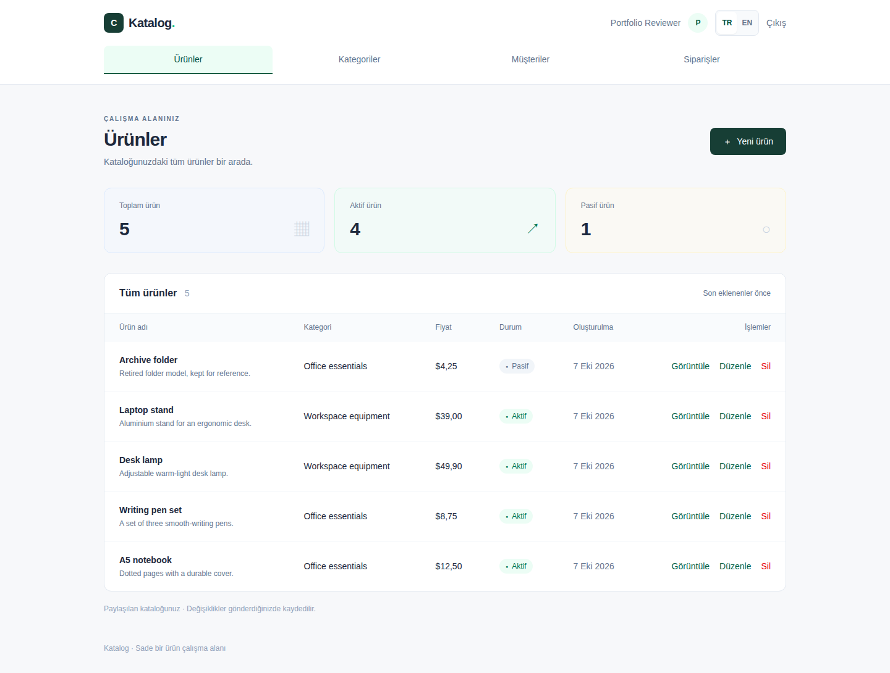

# DemoErp — Katalog iş uygulaması

[English README](README.md) · [Mimari](docs/ARCHITECTURE.md) · [Veritabanı](docs/DATABASE.md) · [API](docs/API.md) · [Geliştirme](docs/DEVELOPMENT.md)

Çalıştırılabilir full-stack portföy projesi: hesap oluşturma/giriş, ürün, kategori ve
müşteri yönetimi, sunucuda fiyatı hesaplanan çok kalemli siparişler. Arayüz anında
Türkçe/İngilizce değişir; dil tercihi saklanır ve mobil listeler kartlara dönüşür.
Uygulama gerçek PostgreSQL entegrasyon testleri ve Chromium tarayıcı testlerinden
geçirildi.

Bu kaynak ağacı bağımsız demonun tamamını içerir. Eski commitlerde anlatılan özel
üretim ERP’si, Windows/Android istemcileri ve barkod modülleri bu uygulamanın parçası
değildir. Eski geçmiş korunur; güncel README mevcut kodu anlatır.

## Uygulanan özellikler

- PBKDF2 parola özeti, JWT giriş ve korunan API/arayüz rotaları.
- Ürün/kategori/müşteri CRUD, aktiflik ve ilişkili kayıtların silinmesini engelleme.
- Zorunlu ürün kategorisi; aktif müşteri/ürünlerle çok kalemli sipariş.
- Sunucudan alınan fiyatlar, fiyat anlık görüntüsü, tek transaction ve benzersiz numara.
- Bekliyor → Onaylandı → Tamamlandı; tamamlanmadan önce iptal.
- Türkçe/İngilizce formlar, hata mesajları, tarih/sayı biçimleri ve mobil görünüm.
- Kalıcı PostgreSQL, otomatik migration, Docker Compose ve Swagger.



## Teknoloji ve yapı

React 19.3.0, TypeScript 5.9.3, Vite 6.4.4, Tailwind 4.3.3; ASP.NET Core/.NET 10,
EF Core 10.0.12, Npgsql 10.0.3, PostgreSQL 17, FluentValidation 12.1.1 ve JWT.
Tam sürüm tablosu ve Mermaid mimari/ER diyagramları [İngilizce README](README.md)'dedir.

Tek API projesinde controller → servis → scoped DbContext → PostgreSQL akışı vardır.
Ayrı Application/Infrastructure assembly’leri yoktur. Kullanıcılar kimlik doğrular;
iş kayıtları kullanıcıya ait değildir ve oturum açanlar arasında paylaşılır.
DTO projeksiyonları parola özetlerini dışarı çıkarmaz; salt okunur sorgular
AsNoTracking kullanır. Sipariş fiyat/tutarları tarayıcıdan kabul edilmez.

## Çalıştırma

Linux container modunda Docker Desktop veya Docker Engine + Compose v2 gerekir.

```sh
git clone https://github.com/SCanerG/DemoErp.git
cd DemoErp
docker compose up --build
```

İstersen .env.example dosyasını .env olarak kopyalayıp geliştirme ayarlarını
değiştir. Örnek değerler yalnız yerel demo içindir; gerçek sırları Git’e ekleme.
Arayüz http://localhost:3000, Swagger http://localhost:5080/swagger adresindedir.
Yeni hesap oluştur; hazır kullanıcı veya iş verisi ekilmez. Migration otomatik
uygulanır. `docker compose down` veriyi korur; `down -v` veriyi siler.

## Doğrulama ve sınırlar

Backend için .NET 10 SDK ve çalışan Docker ile `dotnet build Catalog.slnx`,
`dotnet test`; frontend klasöründe `npm ci`, `npm run build`,
`npx playwright install chromium`, `npm run test:e2e` çalıştırılır.
Tarayıcı testleri çalışan uygulama gerektirir. Sonuçlar [VERIFICATION.md](VERIFICATION.md)
ve tekrar üretilebilir komutlar [DEVELOPMENT.md](docs/DEVELOPMENT.md)'dedir.

Rol/tenant, sayfalama, token yenileme/iptal, parola kurtarma, stok, vergi, indirim ve
ödeme yoktur. Normal kayıt güncellemelerinde son yazma kazanır; sipariş durumunda
eşzamanlı değişiklik denetlenir. Para birimi USD’dir. Üretim dağıtımı veya yük testi
yapıldığı iddia edilmez. GitHub Actions yapılandırıldı; hazırlanan sürümün uzaktaki
CI çalışması yayın öncesinde doğrulanamaz.

Teknik değerlendirme için yayımlanır; açık kaynak lisansı verilmez.
[Kullanım koşulu](NOTICE.md).
