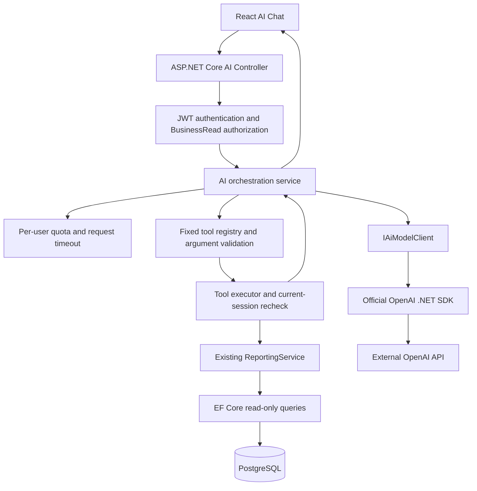

# AI Business Assistant

[README](../README.md) · [Security and privacy](AI_SECURITY.md) · [Reporting definitions](REPORTING.md) · [Verification](../VERIFICATION.md)

Phase 6 extends the existing .NET 10 / EF Core / PostgreSQL application. It adds no
tables, migrations, vector database, agent framework or persistent chat history.
All tools are read-only. Viewer, Manager and Admin share BusinessRead permission.



## Request lifecycle

`GET /api/ai/status` requires BusinessRead and returns only `{ enabled, configured,
available }`. Available means locally configured, not confirmed provider health.
It performs no provider request and does not expose endpoint, key or internal errors.

`POST /api/ai/chat` accepts exactly the supported business input:

```json
{"message":"Summarize sales for the last 30 days.","language":"en"}
```

The server accepts 1–2,000 characters and `en` or `tr`, checks optional feature
configuration, rechecks the active authenticated identity, then consumes quota.
The model receives server-owned instructions, the question and registered schemas.
No client system messages, history, user IDs, role overrides or model selection
are forwarded. Each request is independent; users must repeat relevant context.

Tool calls execute sequentially because EF Core's scoped DbContext is not safe for
parallel queries. Arguments must match the complete expected property set, with
no unknown or duplicate fields. IDs and call counts are bounded. Before each tool,
the executor checks the database user's active flag, SecurityVersion and role
against JWT claims and runs the tool's explicit authorization policy again. A
final recheck discards the answer if the session changed while the provider worked.
Revocation cannot recall data already sent to a provider during an earlier valid call.

The executor builds typed, minimized data results and server-generated source
records. Only actual successfully executed tools contribute sources. The model
cannot attach a citation or choose a report URL. Tool payloads contain UTC generation
time, range if applicable, data basis, USD currency and a `hasData` indication.
The API returns `{ answer, language, generatedAtUtc, sources, requestId }`; sources
contain type, fixed name/label, validated parameters and a fixed application report
path. Links open the report; users should apply the displayed source period there.

The provider returns strict JSON with answer and language. The server validates the
language tag, nonempty text and length. This is not a linguistic proof; live model
language quality still requires evaluation. With no tools, the server replaces the
answer with a deterministic read-only/no-data explanation. When all retrieved tools
have no matching records, it replaces the answer with a deterministic empty-data
response. Nonempty-data answers can still misinterpret facts; sources remain visible.

## Registered tools

Every tool explicitly requires **BusinessRead**. There are no mutation or Admin-only
tools exposed to the model.

| Fixed tool name | Parameters | Data and reporting reuse |
| --- | --- | --- |
| `get_sales_summary` | startDate, endDate, comparePrevious | CompletedAt sales/count/average; optional equally long preceding period, backend-calculated difference and percent; legacy exclusion count |
| `get_top_products` | startDate, endDate, limit | Existing Products report, completed sales ranking, stored item prices, current stock |
| `get_order_status_summary` | startDate, endDate | Existing Statuses report: orders created in the period, with current status |
| `get_low_stock_products` | limit | Existing Inventory report: positive quantity at or below minimum |
| `get_out_of_stock_products` | limit | Existing Inventory report: zero quantity |
| `get_top_customers` | startDate, endDate, limit | Existing Customers report, only customers with completed sales; pseudonymous identifiers, no names or contacts |
| `get_inventory_overview` | none | Small SQL aggregate of all current inventory records; in-stock includes low-stock |
| `get_pending_orders` | limit | Current all-time Pending count and oldest bounded orders; no customer fields |
| `get_stock_risk` | startDate, endDate, limit | Reuses completed-line query; SQL demand aggregation and current stock coverage, least days first |

SalesMetrics and CompletedLines are shared with existing reporting paths rather
than reimplemented in the controller. Added current-pending/overview/coverage
queries supply only capabilities missing from Phase 5. Ranking limits are 1–10;
the server default is 10, and strict schemas require an explicit limit in calls.
Date-bearing tools require both dates or two nulls. Nulls mean the last 30 rolling
days. Explicit timestamps need a timezone; the server normalizes UTC. Periods are
half-open, positive and at most 366 days; comparison periods have the same maximum.
Explicit start years must be at least 2000 and end dates at most 366 days ahead.
Stock coverage requires at least one day and excludes products with zero completed
demand. Coverage = current quantity × period days / completed quantity, calculated
by the backend, assuming constant demand. It is an estimate, not a replenishment
forecast; returns, seasonality and incoming stock are not modeled.

Completed orders without CompletedAt remain excluded from historical sales; no
legacy dates are fabricated. Pending orders are current across all creation dates.
Status distribution uses OrderDate, while completed-this-month totals use sales
summary with the month's completion window. Product names may be current names;
historical price snapshots remain stored order/item prices, not current prices.

## Provider configuration

The official **OpenAI .NET SDK 2.14.0** uses Chat Completions function calling and
strict answer JSON. Default model is the supported snapshot
`gpt-4.1-mini-2025-04-14`, confirmed in the [official model documentation](https://developers.openai.com/api/docs/models/gpt-4.1-mini).
The [official function-calling guide](https://developers.openai.com/api/docs/guides/function-calling)
describes the application-executed tool/output cycle; [SDK documentation](https://developers.openai.com/api/docs/libraries)
identifies the supported .NET package. Not every configurable model supports these
same options. Changing model requires compatibility and quality testing. Newer
Responses-only models cannot be substituted into this Chat Completions adapter.

Copy `.env.example` to ignored `.env`; keep AI disabled until privacy/cost review.
For an authorized deployment, set `AI_ENABLED=true` and provide `AI_API_KEY` through
a backend secret mechanism, then recreate the backend. Do not use a VITE variable.
No real key is committed and no billable live calls run in CI.

| Compose environment / backend option under AiAssistant | Default / allowed |
| --- | --- |
| `AI_ENABLED` / Enabled | false |
| `AI_PROVIDER` / Provider | OpenAI only |
| `AI_MODEL` / Model | gpt-4.1-mini-2025-04-14; server controlled |
| `AI_ENDPOINT` / Endpoint | https://api.openai.com/v1 only; arbitrary hosts rejected |
| `AI_API_KEY` / ApiKey | empty; backend only |
| `AI_TIMEOUT_SECONDS` / TimeoutSeconds | 30; 1–120 |
| `AI_MAX_OUTPUT_TOKENS` / MaxOutputTokens | 1000; 100–2000 per provider response |
| `AI_MAX_TOOL_CALLS` / MaxToolCalls | 5; 1–5 total per request |
| `AI_REQUESTS_PER_MINUTE` / RequestsPerMinute | 10; 1–60 |
| `AI_REQUESTS_PER_DAY` / RequestsPerDay | 100; 1–1000 |

Missing/invalid AI configuration disables availability without failing unrelated
ERP startup. Provider and endpoint are checked before use. Azure OpenAI is not
implemented: another IAiModelClient adapter and deployment-specific endpoint and
credential validation can be added later without changing the controller/tools.

## Limits, errors and observability

At most two tool rounds and one final answer round, five tool calls total, ten rows
per ranking/list, 20,000 serialized characters per tool payload, 2,000 input characters,
8,000 answer characters and a 16 KB HTTP body. SDK retries are disabled. Linked
cancellation bounds the entire request, provider calls and EF queries. The final
round exposes no tools. Conversation UI keeps at most 20 exchanges in component
memory; refresh/navigation resets it. Cancel/unmount aborts requests. React renders
plain text, never model HTML or Markdown links. TanStack mutations neither retry nor
invalidate business reports for this read-only request.

Quotas are per authenticated user, per UTC minute and UTC calendar day, including
attempts that subsequently fail. Disabled/configuration-invalid requests do not
consume quota. A bounded 10,000-entry expiring memory cache stores counters only;
when capacity cannot admit another user it rejects the request. Quotas reset on
process restart and are per API instance. Multi-instance production deployment
needs a shared enforcement mechanism or gateway; this demo does not add Redis.

| Problem code | HTTP |
| --- | --- |
| aiInvalidRequest, aiInvalidArguments, aiUnknownTool, aiToolLimit | 400 |
| aiUnauthorized / aiForbidden | 401 / 403 |
| aiRateLimit, aiProviderRateLimit | 429 |
| aiInvalidResponse | 502 |
| aiDisabled, aiNotConfigured, aiProviderUnavailable, aiToolFailure | 503 |
| aiTimeout / aiCancelled | 504 / 499 |

Anonymous/revoked JWTs can be rejected by existing middleware before these codes.
An HTTP disconnect normally prevents delivery of the cancellation response.
Provider exceptions are replaced with safe BusinessExceptions without inner
exceptions before existing error middleware can log them. Logs contain request ID,
user ID, UTC timestamp, provider/model, executed tool names, latency, outcome and
token usage when supplied (zero when not reported). They contain no prompts,
conversations or raw tool payloads and never create business mutation audit rows.

Cost is bounded, not free: as many as three provider requests include instructions,
schemas, question and preceding tool results. MaxOutputTokens applies per response,
not a combined token budget. Input size is bounded by the question and bounded tool
results; provider tokenization varies. Use deployment budgets, provider rate/spend
controls and monitoring in addition to local quotas. No price estimate is hardcoded.

## Testing and future extension

Backend tests use fake IAiModelClient orchestration plus actual ASP.NET endpoints,
JWT policies and disposable PostgreSQL. SDK adapter tests intercept HttpClient
transport and exercise real SDK serialization, correlation and safe failure mapping
without networking. Browser tests use a real default-disabled Docker endpoint and
explicitly mocked enabled chat/status responses for UI states. Mocked answers are
not evidence of live-provider accuracy. See VERIFICATION for actual execution results.

Future RAG can add a separately authorized, bounded document-search tool to the
registry/executor. Document access, classification, ingestion, citations and provider
processing must be designed and tested separately. No uploads, embeddings, PDF
ingestion, document tools, vector search or pgvector exist in Phase 6.

## Twelve interview questions

1. **How is OpenAI integrated in .NET?** An official SDK adapter implements IAiModelClient, with backend credentials, cancellation, strict schemas and safe errors.
2. **Why dependency injection?** Scoped orchestration/tools reuse the scoped ReportingService/DbContext; options/quota are singleton, and tests replace the model adapter.
3. **What does function calling do?** The model requests a named function with JSON arguments. Application code validates, authorizes and executes it; the model receives bounded results.
4. **Where are tools authorized?** At the endpoint and immediately before every tool, using the current database identity and explicit policy; final delivery also rechecks the session.
5. **What belongs in the prompt?** Language, business definitions, date semantics, evidence requirements and interpretation limits. Permissions remain in code.
6. **How is prompt injection mitigated?** Treat user/catalog strings as untrusted; fixed tools, strict arguments and policy checks prevent arbitrary writes/SQL. Answer manipulation remains possible.
7. **How do JWT and RBAC interact?** Valid signed JWTs must still match an active user's current SecurityVersion and role; BusinessRead permits all three defined roles.
8. **What data leaves the app?** The question and selected minimized report results. Customer identities are pseudonymous; contacts, hashes, JWTs and audit rows are excluded.
9. **How are hallucinations reduced?** Backend-calculated facts, source metadata from actual tools, empty/no-tool fallback and clear report links. Nonempty summaries still need review.
10. **How are AI costs controlled?** Per-user quotas, short inputs, bounded rows/tokens, five calls/two tool rounds, timeout, no retries, plus deployment/provider budgets.
11. **How do tests avoid paid calls?** Fake model responses exercise orchestration with real PostgreSQL; intercepted HTTP exercises official SDK wire contracts and failures.
12. **Why tools rather than RAG for ERP totals?** Structured data requires authorized SQL/EF aggregation with exact business semantics. RAG retrieves document passages and needs separate document permissions.
