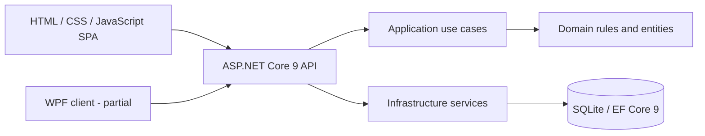

# Architecture

The private application follows a layered monolith structure. This is an architectural
direction, not a claim that every existing module is perfectly isolated.

## Responsibilities

- **Domain:** value validation, state transitions and entity behavior.
- **Application:** use cases, repository contracts, authorization context and orchestration.
- **Infrastructure:** EF Core persistence, migrations and integration services.
- **API:** HTTP endpoints, authentication policies and static web client hosting.
- **Desktop:** Windows-specific client; not yet equivalent to the web client.

Some modules currently use infrastructure services directly from endpoints.
The browser application also contains a large shared script alongside module scripts.
Both are refactoring opportunities, not hidden behind a claim of strict Clean Architecture.

## Decisions and trade-offs

- SQLite keeps local development simple. PostgreSQL is not yet configured.
- Business invariants are checked on the server as well as in forms.
- Archive revisions retain original bytes; metadata and hashes enable traceability.
- Stock correctness tests include independent readers and duplicate posting cases.
- ZPL previews run locally, avoiding transfer of label content to external renderers.
  The preview is partial and cannot substitute for printer acceptance tests.
- Multi-company SaaS isolation, production deployment and enterprise security
  hardening remain separate delivery work.

.NET 9 is the current project target, not a promise about long-term platform support.
Runtime lifecycle and upgrade planning must be reviewed before production deployment.
