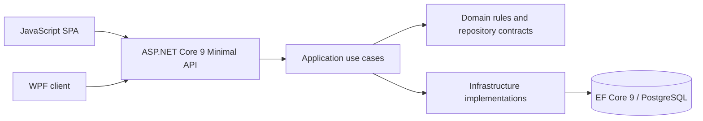

# Architecture / Mimari

DemoErp is a layered manufacturing monolith. The public sample is intentionally smaller than the private solution.

The arrows describe runtime flow, not project reference direction. Repository contracts live in Domain; Infrastructure implements them. API is the composition root. Existing UnitOfWork and repositories remain part of the application; no claim is made that every module is fully isolated.

## Review path / İnceleme yolu

JWT login → protected product/material catalog → create/read/update/deactivate → EF Core persistence → logout.

Product cards use request models and a ProductCardDto response mapper. Deactivation preserves manufacturing and stock history. Technical carpet cards and inventory material cards remain separate models.

The web SPA uses hash navigation and shared API helpers. It is not React or TypeScript today. Some endpoints directly orchestrate repositories or infrastructure services; extracting these responsibilities remains refactoring work.

## Security and configuration / Güvenlik ve yapılandırma

Access tokens use JWT validation and role policies. Refresh tokens use HttpOnly, SameSite=Strict cookies and hashed database records with rotation. Access tokens are returned to clients and also set as cookies for compatibility. Browser and API are served from the same origin; no cross-origin frontend deployment is claimed.

PostgreSQL is the default application provider; credentials and signing keys come from environment variables. Separate migrations support PostgreSQL and SQLite test/legacy paths. Docker Compose uses a persistent PostgreSQL volume. Production HTTPS, cookie policy, session revocation and deployment acceptance require further verification.

## Target direction / Hedef

Focus the portfolio on authentication and existing product CRUD. Evaluate React/TypeScript with Vite and a separate frontend directory, upgrade the backend to .NET 10, and add OpenAPI documentation. These are planned changes.

The current source layout is `src/DokumaERP.Api`, `src/DokumaERP.Application`, `src/DokumaERP.Domain`, `src/DokumaERP.Infrastructure`, `src/DokumaERP.PostgreSqlMigrations`, plus Desktop, tests and tools. The public repository exposes only `samples/` and documentation.
