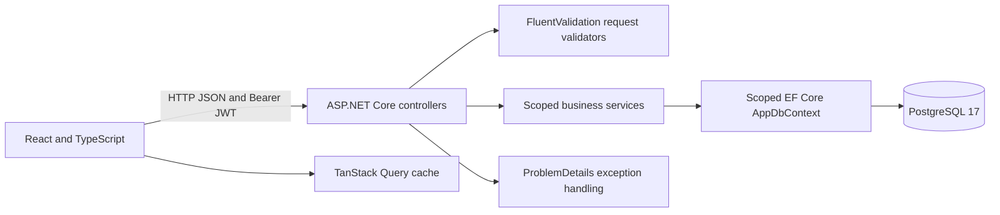

# Architecture

[README](../README.md) · [Database](DATABASE.md) · [API](API.md) · [Development](DEVELOPMENT.md)

The repository contains one ASP.NET Core API project and one React application.
`Domain`, `Contracts`, `Services` and `Data` are directories within `Demo.Api`;
there are no separate Application or Infrastructure assemblies.

Controllers own HTTP status codes and validation. Services implement authentication,
catalog operations, reference checks and order transitions. Dependency injection
creates a scoped context/services per request; token generation is a singleton
using validated JWT options. EF tracking and transactions provide the persistence
boundary without additional repository or unit-of-work wrappers.

Read operations use `AsNoTracking` and explicit DTO projections, including category
names, counts and order-line product names. Order reads avoid per-line queries.
Lists currently return all rows; pagination and load testing are not implemented.
TanStack Query owns server state and mutation invalidation. React Hook Form/Zod
provide immediate form feedback; the backend remains authoritative.

## Authentication and errors

Registration normalizes email; a unique database index handles races. Identity's
PBKDF2 hasher uses 210,000 iterations. JWT Bearer validates HS256, signature,
issuer, audience and expiry. Authentication requests are limited to 20/IP/minute.
Safe DTOs exclude password hashes. Business records are shared by authenticated
users, with no role or tenant partitioning.

Browser sessions use sessionStorage with a memory fallback. Current-session 401
or expiry clears authentication/cache; late responses for a replaced token do not
clear the new session. Logout does not revoke an issued token. This browser storage
is accessible to JavaScript; production hardening would need an explicit XSS and
identity strategy.

Validation returns 400 ProblemDetails, missing records 404 and reference/status
conflicts 409. Unexpected failures produce a generic 500 with a trace ID and JSON
server logs. Request bodies and sensitive SQL values are not logged.

## Orders

One repeatable-read transaction checks active references, reads current database
prices, allocates a sequence number and saves the order and all items. A failure
rolls back every business write. Sequence allocation is not rolled back, so gaps
are expected. Unit prices are snapshots; names remain live references.

Conditional status updates detect concurrent transitions. Product/category/customer
edits use last write wins. Referenced records cannot be physically deleted; inactive
records remain readable. There is no order deletion API.

## Localization and deployment

`translations.ts` plus a lightweight React external store provides immediate TR/EN
switching and localStorage preference persistence. Document language/title and
number/date formatting follow the selected locale. Currency remains USD and
user-entered data is not translated.

Compose runs PostgreSQL, API and an unprivileged Nginx frontend, with ordered health
checks and a persistent database volume. API startup applies committed migrations
with bounded retries. Host ports bind to localhost; PostgreSQL is internal.
Swagger is Development-only. Production migrations/deployment, HTTPS and distributed
rate limiting are outside the demonstrated scope.
