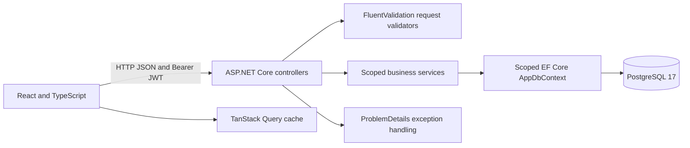
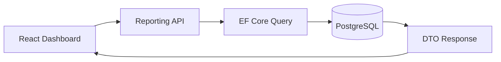

# Architecture

[README](../README.md) · [Database](DATABASE.md) · [API](API.md) · [Development](DEVELOPMENT.md) · [Inventory](INVENTORY.md)

The repository contains one ASP.NET Core API project and one React application.
`Domain`, `Contracts`, `Services` and `Data` are directories within `Demo.Api`;
there are no separate Application or Infrastructure assemblies.

Controllers own HTTP status codes and validation. Services implement authentication,
catalog operations, reference checks and order transitions. Dependency injection
creates a scoped context/services per request; token generation is a singleton
using validated JWT options. EF tracking and transactions provide the persistence
boundary without additional repository or unit-of-work wrappers.

The optional [AI Business Assistant](AI_ARCHITECTURE.md) adds a bounded, read-only
orchestrator and fixed tool registry above the existing ReportingService. Its
IAiModelClient adapter uses the official OpenAI .NET SDK; credentials stay in backend
configuration. The feature is off by default and adds no database schema or chat storage.

Read operations use `AsNoTracking` and explicit DTO projections, including category
names, counts and order-line product names. Order reads avoid per-line queries.
Business lists currently return all rows; audit history uses server pagination and
filters. Load testing is not implemented.
TanStack Query owns server state and mutation invalidation. React Hook Form/Zod
provide immediate form feedback; the backend remains authoritative.

## Authentication and errors

Registration normalizes email; a unique database index handles races. Identity's
PBKDF2 hasher uses 210,000 iterations. JWT Bearer validates HS256, signature,
issuer, audience and expiry. Authentication requests are limited to 20/IP/minute.
Safe DTOs exclude password hashes. Business records remain shared without tenants,
while explicit Admin/Manager/Viewer policies restrict operations. Every protected
request reads the user's active flag, role and SecurityVersion to reject stale tokens.
See [security flow and bootstrap](SECURITY.md) and [permission matrix](AUTHORIZATION.md).

Browser sessions use sessionStorage with a memory fallback. Current-session 401
or expiry clears authentication/cache; late responses for a replaced token do not
clear the new session. Logout does not revoke an issued token. This browser storage
is accessible to JavaScript; production hardening would need an explicit XSS and
identity strategy.

Validation returns 400 ProblemDetails, missing records 404 and reference/status
conflicts 409. Unexpected failures produce a generic 500 with a trace ID and JSON
server logs. Request bodies and sensitive SQL values are not logged.

## Orders

One repeatable-read transaction checks active references, reads current database
prices, allocates a sequence number and saves the order and all items. A failure
rolls back every business write. Sequence allocation is not rolled back, so gaps
are expected. Unit prices are snapshots; names remain live references.

Order status changes use a ReadCommitted transaction and an Order row lock, then
deterministically ordered Inventory row locks. Confirmation deducts stock and records
movements; confirmed cancellation reverses actual deductions. Repeated statuses do
not change stock. A filtered unique movement index adds duplicate protection.
Product/category/customer edits use last write wins. Referenced records, including
products with stock history, cannot be physically deleted. There is no order deletion
API. [Inventory locks, transactions and legacy-order handling](INVENTORY.md).

## Administration and audit

UserService serializes administrative changes with a PostgreSQL advisory transaction
lock and rechecks the actor under that lock. Self-demotion/deactivation and removal
of the last active Admin are blocked. A one-time configuration bootstrap creates a
new Admin after migrations, without promoting existing accounts. It is disabled by
default and has a persisted marker for restart safety.

AppDbContext.SaveChangesAsync stages explicit allowlisted AuditLog entries with
business writes. Existing transaction boundaries are preserved; EF implicit
transactions cover ordinary tracked CRUD. Product updates lock the product row for
accurate before values. InventoryMovement remains the quantity ledger. Audit reads
are Admin-only, filtered and paginated. [Fields, diagrams and boundaries](AUDIT_LOGGING.md).

## Reporting reads

DashboardController and ReportsController reuse BusinessRead and a scoped
ReportingService alongside the existing services. GroupBy/Select produce scalar
PostgreSQL aggregates and DTOs; sorting uses explicit expressions with stable IDs,
and filtering/pagination remain in SQL. CompletedAt is maintained by the existing
OrderService transaction. No CQRS, repository wrapper, caching service or reporting
engine was introduced. The React reporting module is lazy loaded and uses one
charting library, Recharts, with TanStack Query for server state. Business mutations
invalidate report/dashboard caches centrally.

[Reporting data flow and business definitions](REPORTING.md) ·
[Actual SQL plans and performance trade-offs](PERFORMANCE.md).

## Localization and deployment

`translations.ts` plus a lightweight React external store provides immediate TR/EN
switching and localStorage preference persistence. Document language/title and
number/date formatting follow the selected locale. Currency remains USD and
user-entered data is not translated.

Compose runs PostgreSQL, API and an unprivileged Nginx frontend, with ordered health
checks and a persistent database volume. API startup applies committed migrations
with bounded retries. Host ports bind to localhost; PostgreSQL is internal.
Swagger is Development-only. Production migrations/deployment, HTTPS and distributed
rate limiting are outside the demonstrated scope.
