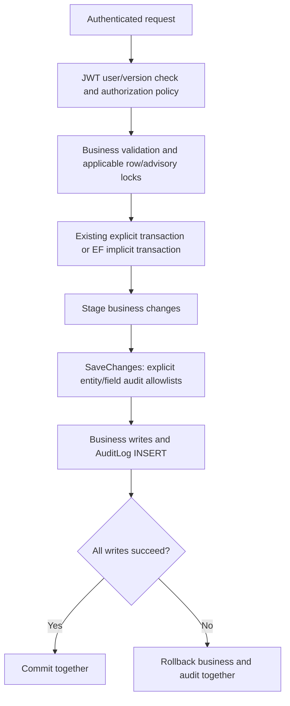
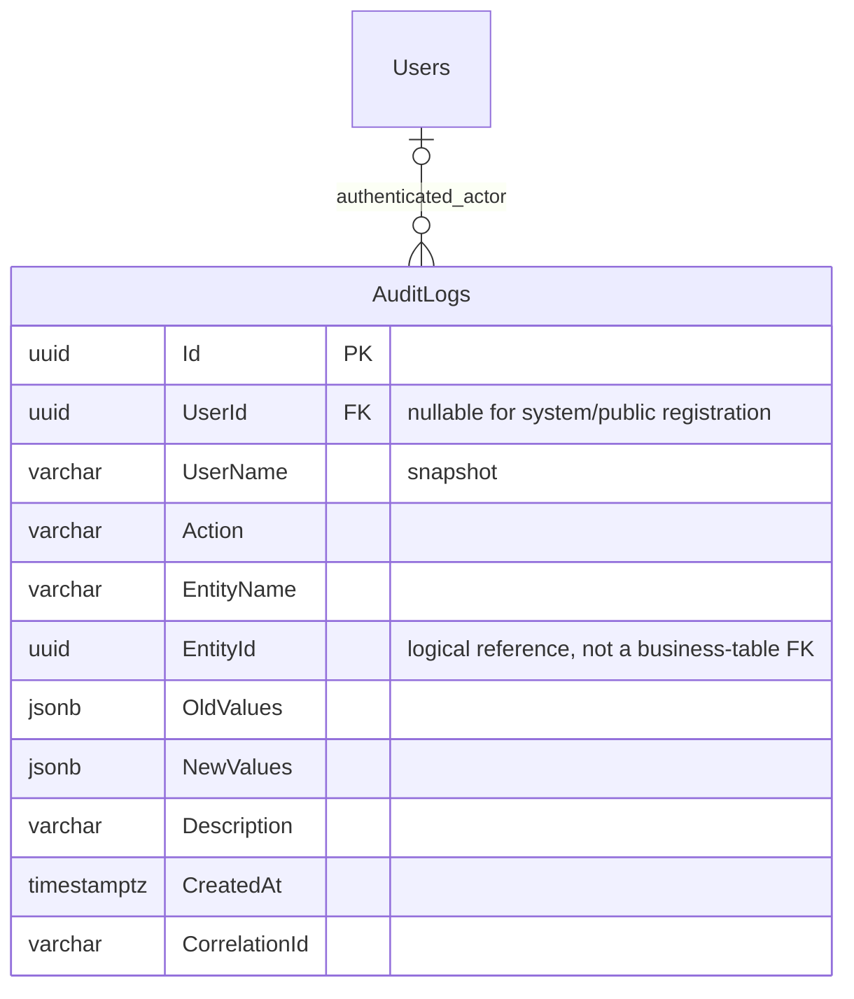

# Audit logging

[README](../README.md) · [Security](SECURITY.md) · [Authorization](AUTHORIZATION.md)

AuditLog records committed business/access operations. InventoryMovement remains
the authoritative quantity ledger; AuditLog does not duplicate its before/after
quantities or manual reasons.

## Data model

UserId is a real optional FK with Restrict deletion. UserName is a historical
snapshot from the server-validated caller's current name. Public registration and
startup bootstrap have no authenticated actor and use a labeled system snapshot.
EntityName/EntityId are logical references, deliberately not polymorphic database
FKs. Deleted business records therefore remain identifiable in audit history.

UTC CreatedAt plus UUID Id provide stable ordering. Indexes cover CreatedAt/Id,
UserId/CreatedAt, EntityName/EntityId and Action/CreatedAt. Before/after columns use
jsonb and contain only the changed allowlisted fields on updates. Create/delete
events contain the available allowlisted snapshot. Description stores a stable
action code translated by the UI. CorrelationId is the server request trace ID.

## Recorded actions and allowlists

| Entity | Actions | Stored fields |
| --- | --- | --- |
| Product | Create/Update/Delete | name, price, active flag, category ID |
| Category | Create/Update/Delete | name, active flag |
| Customer | Create/Update/Delete | name, active flag |
| Order | Create/OrderConfirm/OrderComplete/OrderCancel | status, customer ID, total, order number, completedAt as applicable |
| Inventory manual quantity operation | StockIn/StockOut/StockAdjustment | movement ID and direction; full quantity/reason data stays in InventoryMovement |
| Inventory minimum | MinimumLevelChange | old/new minimum level |
| User | Create/Update/RoleChange/Activate/Deactivate | name, email, role, active flag as applicable |

Customer address/phone/email and free-form descriptions are deliberately omitted.
A change only to an omitted product/category/customer field still produces an Update
event without copying that value. Password/hash rehash and internal version/timestamp
changes alone do not create public audit events. Ordinary GET requests are not logged.
Repeated no-op order transitions have no duplicate audit or quantity movement.

## Implementation and transaction boundaries

AppDbContext.SaveChangesAsync has a small explicit switch for these six entity types
and allowlisted properties. It stages AuditLog entries before calling EF's base
SaveChangesAsync; it does not use reflection to serialize entities or introduce an
external/generic audit framework. Generated GUIDs are available before inserting new
rows. Application services use asynchronous tracked writes so all relevant entries
participate. Physical business deletions use tracked deletes to capture safe old
values; product inventory deletion is left to PostgreSQL's parent-delete cascade.

Product updates lock the product row so their audit old values correspond to the
serialized update. User mutations share the administrative advisory lock and one
transaction. Orders retain their explicit creation/status transactions. Stock and
minimum changes retain inventory row locks and their explicit transaction. Category/
customer/product creation and ordinary category/customer saves/deletes use EF's
implicit SaveChanges transaction for business plus audit entries. Any SQL audit
insertion failure rolls back the corresponding change. No nested transaction is
introduced. Category/customer edits retain last-write-wins semantics; their old values
describe the version read for the operation, without an optimistic concurrency token.

Raw SQL/ExecuteUpdate/ExecuteDelete do not automatically create audit rows. They are
used for migrations and controlled test fixtures, not the application's audited
business mutation paths. This is application auditing, not database CDC. The immutable
trigger rejects ordinary UPDATE/DELETE of AuditLogs; no audit mutation API exists.

## Read API and UI

Admin-only endpoints:

- GET /api/audit-logs
- GET /api/audit-logs/{id}

List filters: page (1–1,000,000), pageSize (1–100, default 20), userId, predefined
action, predefined entityName, from and to. Dates are normalized to UTC; bounds are
inclusive and from must not exceed to. Invalid values return 400. Results contain
items, page, pageSize and totalCount; ordering is newest CreatedAt then Id descending.
Read queries use AsNoTracking. Offset pagination can shift under new arrivals; a
snapshot or cursor pagination is not implemented. Count/page queries are separate.

The responsive TR/EN UI filters on the server and offers pagination, text-labeled
action badges and a detail page. Details show before/after changed fields, actor,
entity ID and correlation ID. User-entered values remain unchanged; role/status/action
labels are localized. There are no edit/delete audit controls.

Tests verify actor/changed fields, safe contents, role/stock/order events, failed
business operations without success entries, PostgreSQL immutability, pagination/
filters and actual failing audit INSERTs for product, role, stock and order changes.
