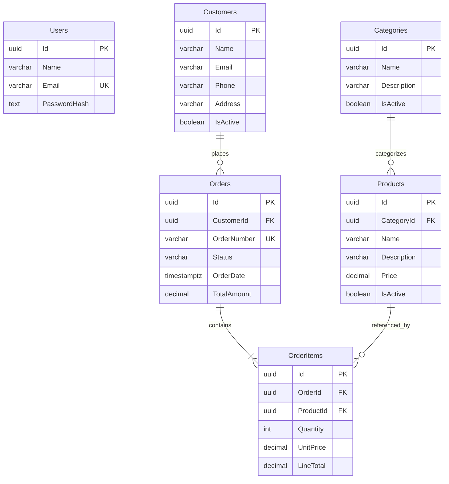

# Database

[README](../README.md) · [Architecture](ARCHITECTURE.md) · [API](API.md)

Phase 3 adds Inventories (required one-to-one product record) and InventoryMovements
(immutable product audit with actor and nullable Order FK). See the
[inventory ERD, constraints and concurrency rules](INVENTORY.md). Unlike business
record ownership, movement CreatedByUserId does reference Users.

PostgreSQL 17 is accessed through EF Core/Npgsql. All entity keys are UUIDs.
Users authenticate callers and have no ownership foreign keys to business records;
inventory movements reference their authenticated actor for auditing.
Users also have Role (Viewer migration default), IsActive, SecurityVersion, UpdatedAt
and an internal IsBootstrapAccount marker. Role/version checks constrain valid values.
AuditLogs reference an optional actor User FK and store allowlisted jsonb old/new
values. Their business entity references are logical identifiers, not polymorphic
FKs. [Audit ERD and indexes](AUDIT_LOGGING.md#data-model).
The diagram shows principal identifiers and business fields; timestamp fields are
described below.

Every API-created order has 1–100 distinct lines. The database enforces each line's
required order/product references; the minimum line count is an application rule,
not a database constraint on the parent order.

| Rule | Implementation |
| --- | --- |
| Normalized user email | Unique index; name ≤100, email ≤254 |
| Product category | Required FK with Restrict deletion |
| Customer/order and product/item | Required FKs with Restrict deletion |
| Order/item | Required FK with Cascade deletion; no public order-delete endpoint |
| Order number | Unique index and bigint `OrderNumbers` sequence |
| Prices | Product/UnitPrice `numeric(12,2)`; nonnegative |
| Totals | Order/LineTotal `numeric(18,2)`; nonnegative order total |
| Quantity | Database >0; request validator integer 1–100,000 |
| Line calculation | Check constraint `LineTotal = Quantity * UnitPrice` |
| Status | String enum with Pending/Confirmed/Completed/Cancelled check constraint |
| FK lookup | Indexes on CategoryId, CustomerId, OrderId and ProductId |

CreatedAt is stored for users, products, categories, customers and orders; UpdatedAt
is nullable for the four business parent entities. UTC timestamps use PostgreSQL
`timestamp with time zone`. Order items have no timestamp fields. Customer email
is optional in the API, stored as an empty string when absent, and is not unique.

## Migrations

1. `20261007185344_InitialCreate`: Users and Products.
2. `20261007205005_BusinessWorkflow`: categories, customers, orders/items, sequence,
   relationships, constraints and FK indexes.
3. `20261009114734_InventoryManagement`: Inventories, InventoryMovements, balance/delta/
   reference checks, indexes, zero-stock backfill, product initialization and audit
   immutability/protection triggers. Existing products/orders/items are preserved.
4. `20261009122237_SecurityAndAudit`: user role/active/version/timestamp/bootstrap
   fields, Viewer backfill, role/version checks, AuditLogs/jsonb/FK/indexes and
   immutable audit UPDATE/DELETE trigger. Existing accounts are never promoted.
5. `20261009132422_ReportingCompletion`: nullable Order.CompletedAt; existing rows
   retain null. Completion transitions set it atomically without inventing history.
6. `20261009133445_ReportingIndexes`: partial completed Order.CompletedAt index and
   composite OrderDate/Id index. See [measured plans and costs](PERFORMANCE.md).

Reporting dates are half-open UTC intervals; current inventory never becomes a
historical balance simply because a date filter was selected. See
[KPI, legacy, date and aggregation definitions](REPORTING.md).

The second migration temporarily adds nullable Product.CategoryId, creates a
`General` category only when existing products need it, backfills those products,
then enforces the required FK. Fresh databases contain no seeded users or business
records. Startup runs these migrations; no manual SQL is needed.

The integration migration test upgrades an actual PostgreSQL database with a legacy
product and checks preservation and model consistency. Price snapshots remain
unchanged after product-price edits; product/customer names reflect later edits.
Sequence numbers may have gaps and do not reset daily; the number's date uses UTC.
