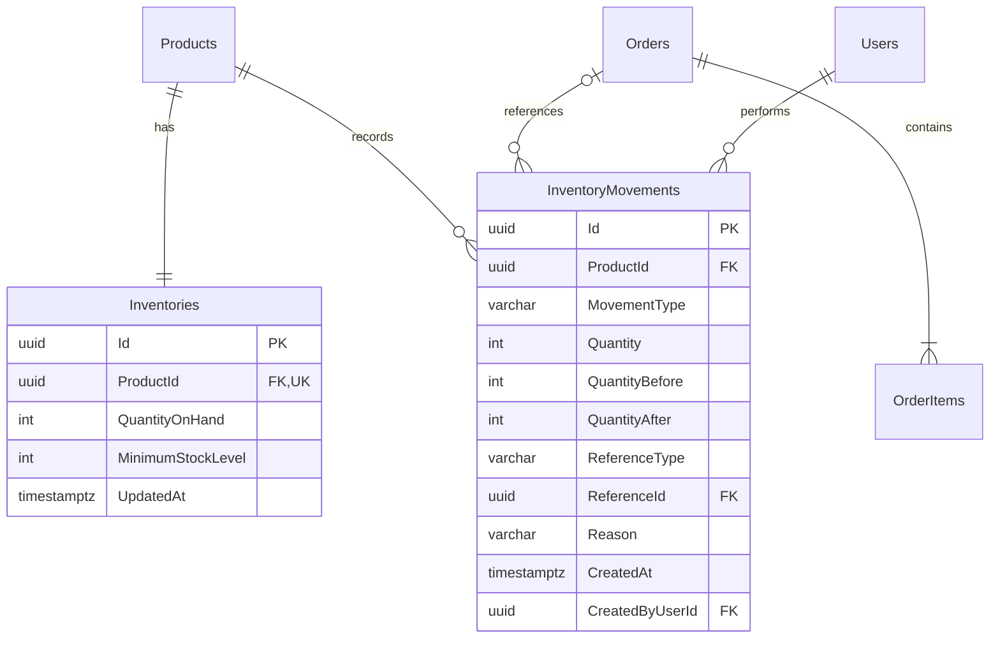
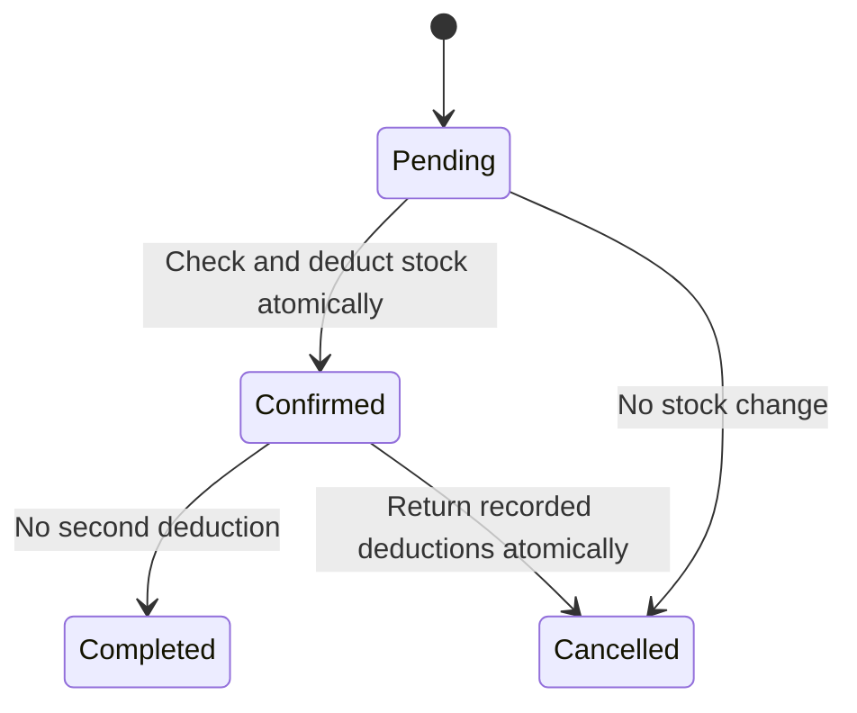
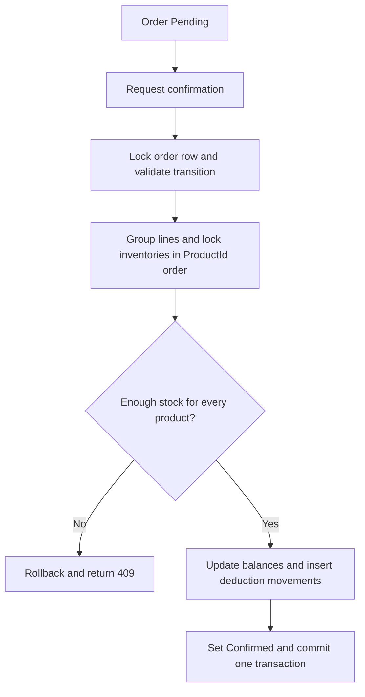

# Inventory and order integration

[README](../README.md) · [Database](DATABASE.md) · [Architecture](ARCHITECTURE.md) · [API](API.md)

## Model and integrity

Each product has one Inventory row. A unique ProductId foreign key prevents
duplicates; a PostgreSQL insert trigger initializes new products at zero, including
SQL inserts. The InventoryManagement migration backfills every existing product
at zero without changing products/orders or inventing opening quantities/movements.
A guard trigger prevents removing/reassigning an inventory row while its product
exists. Empty, unreferenced products can still be deleted with their inventory.

ReferenceId is a nullable **real FK to Orders**, not an arbitrary polymorphic ID.
ReferenceType is constrained to Manual/null or Order/non-null. Product and actor
are required FKs. All timestamps are UTC. Quantities and minimum levels use
PostgreSQL integer units (maximum 2,147,483,647), with nonnegative check constraints.
Movement quantity is positive; before/after balances are nonnegative and constrained
to match the movement direction/delta. Reasons are required, at most 1,000 characters.

InventoryMovement is a simple audit ledger. PostgreSQL rejects UPDATE and DELETE
on movement rows. Referenced products, orders and users cannot be deleted. A
product with movement history must be deactivated even after its balance reaches
zero. No movement edit/delete endpoint exists. This is not event sourcing; normal
business reads use the current Inventory row.

## Controlled operations

| Operation | Movement | Quantity effect |
| --- | --- | --- |
| Stock in | StockIn | Add a positive quantity |
| Stock out | StockOut | Subtract; reject shortage with 409 |
| Adjustment, Increase | AdjustmentIncrease | Add with required reason |
| Adjustment, Decrease | AdjustmentDecrease | Subtract with required reason; reject shortage |
| Order confirmation | OrderDeduction | Subtract grouped order-line quantities |
| Confirmed cancellation | OrderCancellationReturn | Return actual recorded deductions |

Minimum-level updates do not change quantity and do not create a quantity movement.
Product create/update DTOs cannot set quantities. Stock changes are committed server
operations, never optimistic browser balances. Manual requests require a reason;
stock-decreasing forms use a keyboard-accessible confirmation dialog. Ordinary manual
operations are not idempotent: submitting a new successful stock-in request twice
records two receipts. Order transitions have independent duplicate protection.

## Order state machine

All other transitions are rejected with 409. Repeating the current status returns
the current order without stock changes. Completed orders cannot be cancelled;
cancelled orders cannot reopen. Pending orders neither reserve nor deduct stock,
and may be created above currently available stock. The UI shows a warning and
current availability; confirmation remains authoritative.

Creation still accepts distinct product lines; confirmation also aggregates duplicate
ProductIds already present in legacy/admin-created orders. Cancellation reads the
immutable OrderDeduction quantities, rather than re-reading mutable product prices
or inventing quantities. Orders already Confirmed/Completed before this migration
have no historical deductions. Cancelling such a legacy confirmed order returns no
stock; the API exposes inventoryWasDeducted and the UI explains that historical case.
There are no invented historical movements or stock reservations.

## PostgreSQL concurrency and transactions

Every writer starts an EF Core **ReadCommitted** transaction. Manual operations lock
their Inventory row with parameterized `SELECT ... FOR UPDATE` before reading the
balance. Concurrent writers wait, then read the newly committed quantity. All
quantity changes use long intermediate arithmetic and reject integer overflow.

Order transitions first lock the Order row. After waiting, they re-read its current
status, so two confirmations of the same order cannot both apply deductions. They
group quantities and lock Inventory rows sequentially in deterministic Guid/ProductId
order. Different orders touching the same products serialize at these rows. Thus,
with 10 units, orders for 8 and 7 cannot both confirm. Reversed input-line order does
not change lock acquisition order. Product deletion also locks inventory before
checking references/history, preventing a receipt/delete race.

An order-specific filtered unique index on (ReferenceId, ProductId, MovementType)
adds a database safeguard against duplicate deduction/return entries. Minimum-level
updates use the same inventory lock. FK/check constraints remain the final integrity
guard. Deadlock, serialization and uniqueness conflicts return safe 409 ProblemDetails;
unexpected failures are logged and return generic 500 with trace ID. No hidden retry
replays manual operations; clients refresh and retry intentionally.

Atomic boundaries:

- Manual change: balance + movement + actor/reason/reference metadata.
- Confirmation: all balances + all deduction movements + Confirmed status.
- Confirmed cancellation: all returns + all return movements + Cancelled status.

SaveChanges and commit share the transaction. Any failure, including an exception
after SQL writes but before commit, rolls back everything when the transaction is
disposed. There are no external calls inside the transaction. Locks are per database
row, so this works across API processes, not only within one in-memory server.

## API and UI

Every endpoint below requires Bearer authentication under the existing shared-data
model. Phase 4 policies allow all roles to read and only Admin/Manager to change
inventory. Responses are DTO projections, not EF entities. Business operations also
create transaction-consistent AuditLog entries; InventoryMovement remains the
authoritative quantity history. [Authorization](AUTHORIZATION.md) · [Audit](AUDIT_LOGGING.md).

| Method | Path |
| --- | --- |
| GET | /api/inventory |
| GET | /api/inventory/{productId} |
| GET | /api/inventory/{productId}/movements |
| POST | /api/inventory/{productId}/stock-in |
| POST | /api/inventory/{productId}/stock-out |
| POST | /api/inventory/{productId}/adjust |
| PUT | /api/inventory/{productId}/minimum-level |

Stock requests: `{"quantity":50,"reason":"Opening count"}`.
Adjustment adds `"direction":"Increase"` or `"Decrease"`.
Minimum level: `{"minimumStockLevel":5}`. Invalid/missing fields return 400,
missing product/inventory 404 and shortages/conflicts 409.

The /inventory dashboard shows total products, positive-stock products (including
low stock), zero-stock products and low-stock products. Out: quantity=0; low:
0 < quantity <= minimum; healthy: quantity > minimum. All products, including
inactive ones, remain visible. Responsive lists/detail/history use text-labeled
badges and mobile cards. Order references link to their originating detail page.
TanStack Query invalidates inventory and movement caches after successful operations
and order transitions. English/Turkish forms, warnings, errors and system movement
reasons switch immediately; user names/manual reasons remain unchanged.

## Tests and limits

Real PostgreSQL/Testcontainers tests cover initialization, validation, balances,
audit metadata/immutability, overflow, reference protection, all invalid transitions,
duplicate legacy lines, multi-product rollback, cancellation, repeated/concurrent
requests, overselling, concurrent adjustments and failure after SQL writes. Migration
tests preserve old product/order data. Playwright covers forms/dialogs, shortage
warnings, confirmation/cancellation, audit links and TR/EN mobile UI.

No warehouses, reservations, lots/serials, suppliers, purchases, invoicing, stock
valuation, automatic replenishment or completed-order returns are implemented.
Lists/history are unpaginated; no load-test claim is made. Database owners can
administratively disable triggers or drop data; audit immutability concerns normal
application operations and ordinary SQL DML, not a tamper-proof external audit service.
At the integer ceiling, a cancellation return can fail safely if intervening receipts
would overflow; the order/balances stay unchanged until capacity is available.

## Interview talking points

1. **How is one-to-one inventory enforced?** Unique FK plus product-insert and
   inventory-protection triggers; migration backfills existing products.
2. **Why PostgreSQL row locks?** FOR UPDATE serializes competing balance writers
   across processes and exposes the committed balance after waiting.
3. **What commits atomically?** Every affected balance, immutable movement and order
   status; one EF transaction rolls all of them back on failure.
4. **What race would a plain read/check/save allow?** Two confirmations could both
   read ten and deduct eight/seven; locked reads prevent that stale decision.
5. **Are stock writes safe?** They read under a lock, validate long arithmetic, and
   save within the same transaction; DB constraints disallow negative balances.
6. **How is the audit protected?** Required actor/reference FKs, delta checks and
   UPDATE/DELETE rejection, plus no public movement mutation endpoints.
7. **Why REST operation endpoints?** They express controlled receipt/issue/adjustment
   commands without allowing arbitrary balance replacement.
8. **Where is validation authoritative?** FluentValidation and business services on
   the API, backed by SQL constraints; Zod only improves feedback.
9. **Why Testcontainers?** Real PostgreSQL proves locks, constraints, triggers and
   rollback behavior that EF InMemory cannot demonstrate.
10. **How does React stay synchronized?** Server responses update detail data and
    related TanStack Query caches are invalidated; no optimistic stock updates.
