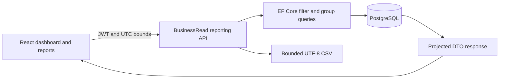

# Executive dashboard and reporting

The authenticated landing page is `/dashboard`. Reports are available at
`/reports/sales`, `/reports/products`, `/reports/customers` and `/reports/inventory`.
All three existing roles use BusinessRead for viewing and exporting. They receive
the same business data; Viewer gains no write permission. User administration and
system audit history remain Admin-only. Anonymous reads and exports return 401.

## Business definitions

| Metric | Definition |
| --- | --- |
| Completed-order sales value | Sum of stored Order.TotalAmount for Completed orders whose CompletedAt is in the period. A demo sales measure in USD, not accounting-recognized revenue. |
| Total orders | Orders whose OrderDate is in the period, regardless of current status. |
| Completed orders | Completed orders whose CompletedAt is in the period. An order created earlier can count here without counting in Total orders. |
| Pending orders | Orders created in the period whose current status is Pending. |
| Active customers / products | Current IsActive count, independent of date selection. |
| Low stock | Current quantity > 0 and quantity <= minimum; includes inactive products. |
| Out of stock | Current quantity = 0; includes inactive products. |
| Healthy stock | Current quantity > minimum. |
| Orders by status | Current status of orders created in the period, not historical transition counts. |
| Product performance | Completed order lines in the completion period: SUM(Quantity), SUM(LineTotal), COUNT(DISTINCT OrderId), plus current inventory. Only products with matching sales appear. |
| Customer total orders | Orders created in the selected period. |
| Customer completed / value / average / last | Completed orders in the completion period; average = completed sales / completed count; last = maximum matching CompletedAt. Customers without matching orders appear with zero values and a null last date. Top Customers excludes zero completed counts. |

OrderDate is set by the server on creation. `CompletedAt` is nullable and set once
inside the existing transaction when Confirmed becomes Completed. Same-status
retries preserve the timestamp and create no additional audit event. Completion
does not deduct stock again. OrderComplete audit values include CompletedAt.

Legacy completed orders retain null CompletedAt: no date is inferred from CreatedAt
or UpdatedAt. They are excluded from all period completed-sales aggregations but
remain visible in creation-date sales reports and current status counts. The dashboard
shows the global number of these legacy records in an explanatory notice.

Product/category/customer names are current names, including inactive records.
Renaming changes report labels; stored UnitPrice/LineTotal/TotalAmount remain
historical. Referenced business records cannot be physically deleted under existing
FK/domain rules. Reports expose names and business totals, not customer contact
details, account credentials or private audit fields.

## Dates and consistency

All backend bounds are UTC and half-open: `Start <= timestamp < End`. API parameters
`start` and `end` accept ISO timestamps with an offset; offsets are converted to UTC.
Omitting both gives the preceding 30 x 24 hours ending at request time. Supplying
only one uses the same rolling 30-day default for the other boundary. Clients should
send both for a reproducible period. Maximum duration is 366 days.

The frontend defaults to 30 local calendar days including today. Last 7/30/90 days,
This year and Custom range use local midnight on the first day and local midnight
after the inclusive final date. Constructing the next calendar day handles DST; it
does not add a fixed 24-hour duration. For Istanbul, 2026-10-09 starts at
2026-10-08T21:00:00Z. UTC chart buckets may therefore include partial days/months
at either edge. Labels explicitly say UTC. Tables format timestamps in the browser's
local timezone with the chosen TR/EN locale; CSV timestamps are UTC ISO 8601.

Sales trend uses daily UTC buckets up to 90 days and monthly UTC buckets above
90 days. SQL aggregates year/month/day parts; the service fills missing buckets
with zero after aggregation. No raw order collection is loaded for charting.
Chart data is also available as an accessible text table. Status counts include
all four statuses even when zero.

Metrics are current reads, not a transaction-wide immutable report snapshot.
Dashboard requests and paged count/data queries can observe intervening writes.
Page ordering is deterministic for a fixed dataset; concurrent inserts/deletes can
still shift offset pages. There is no ledger reconstruction of historical stock.

## API and filters

| GET endpoint | Purpose |
| --- | --- |
| `/api/dashboard/summary` | Eight KPIs and legacy completion warning count |
| `/api/dashboard/sales-trend` | Granularity plus chronological zero-filled points |
| `/api/dashboard/order-status` | Four current-status counts for orders created in period |
| `/api/dashboard/top-products` | At most ten products, sales descending then ProductId |
| `/api/dashboard/top-customers` | At most ten customers with completed orders, sales descending then CustomerId |
| `/api/reports/sales` | Creation-date orders, every selected status |
| `/api/reports/products` | Completion-date product aggregates and current stock |
| `/api/reports/customers` | Creation and completion aggregates joined by customer |
| `/api/reports/inventory` | Current stock; rejects date parameters |
| `/api/reports/{sales,products,customers,inventory}/export` | Four bounded, authorized CSV endpoints |

`GET /api/orders/{id}` and status-change responses additionally expose nullable
`completedAt`; existing fields and workflow are preserved.

| Report | Additional filters | Sort allowlist (default first) |
| --- | --- | --- |
| Sales | customerId, status, minimumTotal, maximumTotal | orderDate, completedAt, totalAmount, customer, orderNumber |
| Products | categoryId, productId | salesValue, quantitySold, product, currentStock |
| Customers | customerId, search (case-sensitive name substring) | salesValue, customer, totalOrders, completedOrders |
| Inventory | categoryId, stockStatus = Low/Out/Healthy, search (case-sensitive name substring) | product, quantityOnHand, minimumStockLevel, updatedAt |

All reports accept `sort`, `descending` (default true), `page` (1–1,000,000),
`pageSize` (1–100, default 20). `sort=default` selects the report's default.
Invalid date/order/page/enum/stock/numeric/sort filters return 400 ProblemDetails;
minimum and maximum totals cannot be negative or inverted. Search is at most 150
characters. Unknown query fields are ignored by standard ASP.NET model binding;
only the documented filters apply to each report.

```json
{"items":[],"page":1,"pageSize":20,"totalCount":0,"totalPages":0}
```

TotalCount describes the filtered dataset. Count and Skip/Take execute in PostgreSQL.
Every supported ordering ends with the entity ID; aggregate default ordering is
sales descending then ID ascending. Cancellation tokens flow into every query.
No new global command timeout or infrastructure was introduced.

## Query and frontend structure

ReportingService uses AsNoTracking, SQL-translatable grouping and explicit DTO
projections. Product line aggregates are grouped before joining one product and
one inventory row, avoiding multiplied sales. Customer creation and completion
counts are independently grouped before left joining Customers. Sales item counts
are correlated SQL aggregates, not per-row application requests. Existing FK
indexes support the joins. There are no Include graphs, dynamic SQL fields or
client-side aggregation of raw business data.



TanStack Query keys contain filters/pages, requests use AbortSignal, and successful
business mutations invalidate dashboard/report caches centrally. Authentication
changes continue to clear the full query cache. Local React state controls filters.
Recharts 3.10.1 is the only added charting library, with a matching React 19 react-is
peer. The reporting module is lazy loaded. No additional application state store
or generic reporting framework was added. Existing unpaged business endpoints
populate selection fields; very large lookup catalogues would need a separate
search/paging enhancement.

## CSV behavior

Exports use the exact same filtered/sorted query as the report, ignoring page and
pageSize for row selection. At most 10,000 rows may be exported. The query takes
10,001 rows to detect overflow and rejects the request before sending CSV headers.
This intentionally uses bounded buffering instead of streaming an unbounded
response or reporting an error after response headers were committed. No endpoint
exports secrets or customer contact fields.

UTF-8 BOM supports Turkish characters in common spreadsheet imports. Every cell
is quoted; embedded quotes are doubled and newlines remain inside quoted cells.
Rows use CRLF. Leading formula operators `=`, `+`, `-`, `@` after whitespace and
leading tab/CR/LF are prefixed with an apostrophe to prevent formula execution.
Numeric and timestamp formatting is invariant; USD remains the demo currency.
CSV headers are English to keep the machine export schema stable across UI locales.
In spreadsheet software that assumes semicolons under Turkish regional settings,
import as UTF-8 with comma as the delimiter; the UI locale does not change CSV syntax.

## Ten interview questions

1. **Why GroupBy in LINQ?** It expresses grouping before materialization. This implementation projects scalar sums/counts so EF generates GROUP BY in PostgreSQL.
2. **Why aggregate stored values?** SUM(LineTotal) and SUM(TotalAmount) preserve captured prices. Multiplying by today's product price would rewrite history.
3. **Does compiling LINQ prove SQL compatibility?** No. Npgsql translation and null/type behavior are verified against real PostgreSQL, including daily/monthly grouping and aggregate left joins.
4. **What does AsNoTracking change?** Read entities are not placed in the change tracker, reducing tracking work. Scalar/DTO projection already avoids most entity tracking; AsNoTracking states the read-only intent.
5. **Why DTO projections?** They select only required columns, define a stable API and prevent accidental serialization of entity graphs or confidential fields.
6. **Why these two indexes?** CompletedAt supports selective completed-sales periods; OrderDate/Id supports creation-period filtering and date ordering. Existing FK and movement indexes already serve other joins. More indexes increase storage and write work.
7. **What does EXPLAIN ANALYZE show?** It actually executes a query and reports plan nodes, estimates versus actual rows, loops and timing. BUFFERS adds cache/page activity; neither replaces end-to-end latency measurement.
8. **Is a correlated item COUNT an N+1 bug?** It is one SQL statement with a database subplan, not N application round trips. Its indexed subplan loops still have a cost visible in EXPLAIN and must be measured.
9. **Why a secondary ID in pagination?** Equal dates/totals otherwise leave row order unspecified. Stable order makes offset pages reproducible on an unchanged dataset; keyset paging is preferable for very deep/changing datasets.
10. **How are performance claims made?** Same deterministic isolated data, same captured EF command and typed parameters, discarded warmup and seven executions with median comparison. Plans and raw samples are saved; unchanged-query noise is not called an index improvement.

See [measured plans, trade-offs and reproduction](PERFORMANCE.md) and
[authorization](AUTHORIZATION.md).
