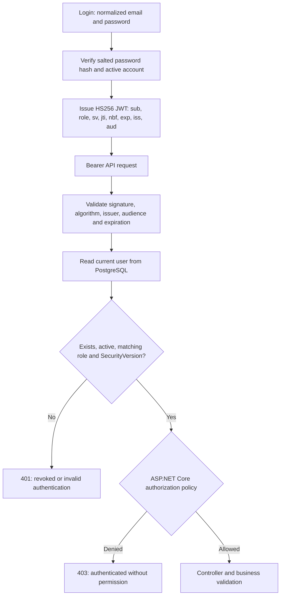

# Security design

[README](../README.md) · [Authorization matrix](AUTHORIZATION.md) · [Audit logging](AUDIT_LOGGING.md)

## Authentication and request authorization



Identity's PasswordHasher uses salted PBKDF2 with 210,000 iterations. Unknown accounts
perform password-hashing work to reduce timing-based enumeration. Inactive accounts
return the same generic login failure as invalid credentials. Successful logins
rehash older password formats when necessary. Authentication endpoints are limited
to 20 requests per IP per minute with an in-process limiter.

JWT contains a subject UUID, predefined role, integer security version and standard
metadata. It carries no password, hash, personal address or unneeded email. RoleClaimType
is explicitly `role`; inbound claim remapping is disabled. Signing configuration
requires a key of at least 32 UTF-8 bytes, nonempty issuer/audience and token lifetime
1–1440 minutes. Development signing placeholders are rejected outside Development.
The accepted algorithm is HS256 with zero clock skew and required expiration.

## Immediate revocation

On every authenticated API request, OnTokenValidated projects only IsActive,
SecurityVersion, Role and Name for the subject. A missing user, inactive account,
missing/invalid version, old version or mismatched role rejects the JWT with 401.
Role changes, activation/deactivation and email changes increment SecurityVersion.
Reactivating an account does not revive its old tokens. Name is taken from this
database read for audit attribution, not trusted client input.

Trade-off: one additional indexed primary-key database query per protected request.
No cache means no cache-expiry window for revoked privileges. Already-authorized
in-flight business requests are not cancelled retroactively; subsequent requests
are rejected. User-management writes additionally revalidate the Admin after their
transaction lock. Browser logout clears local state but does not revoke a token
server-side. There is no refresh token, per-token denylist or password-reset flow.

## One-time initial Admin provisioning

Bootstrap is disabled by default and has no public HTTP endpoint. Supply the following
values in an ignored `.env` or secret environment configuration, without committing
real values:

```dotenv
BOOTSTRAP_ADMIN_ENABLED=true
BOOTSTRAP_ADMIN_NAME=<your admin display name>
BOOTSTRAP_ADMIN_EMAIL=<a new admin email address>
BOOTSTRAP_ADMIN_PASSWORD=<a unique password of 12-128 characters>
```

Run `docker compose up --build --wait`. Startup first applies migrations, acquires
the shared user-management database lock and creates a new Admin only if no Admin
or previously provisioned bootstrap account exists. The password is hashed and is
never logged. An existing email collision fails safely; it never promotes that
registered account. Invalid bootstrap fields fail startup with a generic message
that excludes submitted values.

After the initial successful startup, set BOOTSTRAP_ADMIN_ENABLED=false, remove
BOOTSTRAP_ADMIN_PASSWORD from the environment file, and run `docker compose up -d
--wait` to recreate the API without the bootstrap secret. Use the new Admin to
create operational users. The internal IsBootstrapAccount marker prevents restart
from recreating/promoting the original account even if its role/status later changes.
Bootstrap does not change an existing password or duplicate an existing Admin.

For host development the corresponding keys are Bootstrap__Enabled, Bootstrap__Name,
Bootstrap__Email and Bootstrap__Password. A local evaluation configuration may be
stored in any ignored file and passed with Compose `--env-file`; there are no committed
working Admin credentials. Docker administrators can inspect container environment
values, so remove the initial secret after provisioning. This is a local demo
provisioning mechanism, not a production secret-management service.

## Sensitive-data boundaries and limitations

Explicit request/response DTOs prevent privilege overposting and hash disclosure.
Audit uses explicit field allowlists and never serializes entity graphs, passwords,
hashes, tokens, headers, configuration, customer contact details or free-form product/
category descriptions. Read operations are not audited. API errors are ProblemDetails
with safe messages and a server correlation ID; request bodies and SQL parameter
values are not logged. Auditing, authorization and inventory history are distinct.

Browser sessions use sessionStorage with memory fallback; JavaScript can access them.
Production deployment would require an explicit HTTPS/XSS/identity strategy, key
rotation, distributed rate limiting and operational monitoring. These are not
implemented here. There are no tenants or row-level business ownership rules. Audit
immutability protects application APIs and ordinary SQL UPDATE/DELETE; database
owners can disable triggers, truncate tables or otherwise administer data.

## Security tests

Tests use real PostgreSQL to verify policies, Viewer registration, overposting,
duplicate normalized emails, inactive login, stale-role/deactivated JWT rejection,
Admin self-protection, concurrent role/status changes, bootstrap restart/collision
behavior, Viewer migration backfill and atomic audit failures. Existing issuer,
audience, signature, expiry and signing-configuration tests remain in place.

## Ten interview questions

1. **Authentication versus authorization?** JWT validation identifies the caller;
   policies decide which operation that caller may perform.
2. **Which JWT claims are necessary?** Subject, role, security version and standard
   token metadata; avoid secrets and unnecessary personal data.
3. **Why three predefined roles?** They match the business matrix without a dynamic
   permission administration framework.
4. **Why ASP.NET Core policies?** Central role membership and named intent keep
   authorization consistent and enforce it before controller execution.
5. **How are JWT privileges revoked?** Increment the user's SecurityVersion and
   compare it with the token on every protected request.
6. **What makes audit atomic?** Business entries and explicit audit entries share
   the same EF SaveChanges transaction and existing explicit transaction boundaries.
7. **What belongs in audit JSON?** Allowlisted changed business fields, not whole
   entities or sensitive request data.
8. **How is the last Admin race prevented?** A PostgreSQL transaction advisory lock
   serializes changes; the actor and active-Admin count are checked under the lock.
9. **Which constraints/indexes matter?** Unique normalized email, role/version checks,
   immutable audit trigger and indexes for ordered/filterable audit reads.
10. **How is security tested?** Real endpoint requests for each role, revoked tokens,
    overposting, concurrent PostgreSQL writes and actual audit INSERT failures.
